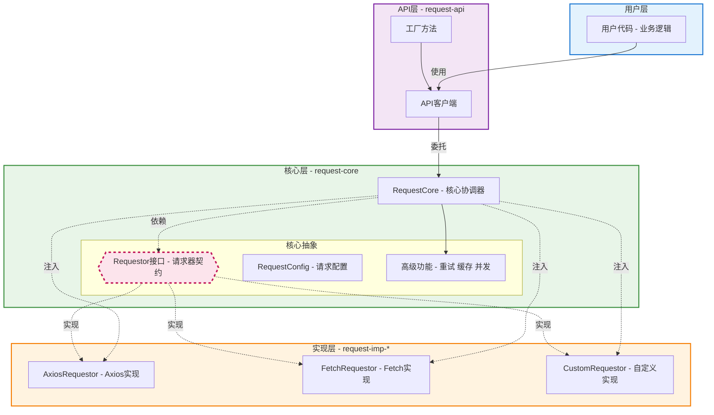

# 架构设计

## 背景

前端生态虽然有许多成熟的请求库，但在实际项目开发中，它们难以完全契合业务需求：

**axios**

axios 是成熟的基础库，但缺少上层功能，如请求重试、缓存、幂等、串行、并发控制等。

**VueRequest / SWR**

这类库提供丰富功能，但存在一些局限：

1. 与上层框架过度绑定，开发场景受限，无法提供统一的 API
2. 成熟度不够，社区支持响应不够及时，存在一定风险
3. 没有聚合基础请求库，仍需手动整合

**核心问题**

公共库不包含公司内部制定的协议规范，即便使用公共库，也必须进行二次封装。

因此需要自行封装一套适配业务需求的前端请求库。

## 技术栈

- **包管理器**: pnpm（利用 workspace 功能管理多包项目）
- **语言**: TypeScript（提供类型安全和接口定义能力）
- **核心依赖**:
  - `axios` 或 `fetch`（作为底层请求实现）
  - `spark-md5`（用于请求哈希，实现幂等性）
- **开发环境**: Node.js (LTS 版本), pnpm

## 架构设计

### 初始设计


整个库结构包含三层，从下往上依次是：

- `请求实现层（request-imp）`: 提供请求基本功能
- `request-core`: 提供网络上层控制，如请求串行、并行、重试、防重等功能
- `request-api`: 为请求绑定业务功能，接入公司内部协议规范和接口文档，向外提供业务接口 API

> 层是对代码结构的逻辑划分，在具体实现上可以采用多种方式：每个层一个 monorepo 子包、每个层一个子文件夹等。

### 优化设计

在三层中，请求实现层的实现有多种方式：基于 `fetch` 原生、基于 `axios` 等第三方库等。

这种实现的多样性可能导致这一层的不稳定，而 `request-imp` 是基础层，它的不稳定性会传导到上一层。

因此必须寻求方案来隔离这种不稳定性。

基于 DIP（Dependence Inversion Principle，依赖倒置原则），可以彻底将 `request-core` 和请求的实现解耦，而 `typescript` 的类型系统让这一切的落地成为可能。

结构演变为：


### 使用示例

最后，应用程序只需要调用 request-api 暴露的业务 API 即可，完全不需要关心底层的实现细节。

```typescript
import { createApiClient } from 'request-api'
import type { RequestCore } from 'request-api'
import { AxiosRequestor } from 'request-imp-axios'

// 1. 定义 API 类
class UserApi {
  constructor(private requestCore: RequestCore) {}

  async getUser(id: string) {
    return this.requestCore.get<User>(`/users/${id}`)
  }

  async getUserList() {
    return this.requestCore.get<User[]>('/users')
  }
}

// 2. 创建 API 客户端
const apiClient = createApiClient(
  {
    user: UserApi,
  },
  {
    requestor: new AxiosRequestor(),
    globalConfig: {
      baseURL: 'https://jsonplaceholder.typicode.com',
      timeout: 5000,
    },
  }
)

// 3. 使用 API
const user = await apiClient.user.getUser('1')
console.log('User:', user)
```

### 架构图



### 核心理念

1. **分层**
   - `request-imp-*`: 提供具体的 HTTP 请求发送能力（如 `request-axios-imp`, `request-fetch-imp`），实现统一的 `Requestor` 接口
   - `request-core`: 核心层，定义 `Requestor` 接口，并基于此接口提供缓存、重试、幂等、并发/串行控制等与具体实现无关的高级功能。通过依赖注入接收 `request-imp` 的具体实现
   - `request-api`: API 层，负责注入 `request-imp` 实现到 `request-core`，调用 `request-core` 提供的功能，集成公司特定业务逻辑和协议规范，并暴露最终给应用使用的 API 函数
2. **依赖倒置（DIP）**
   - `request-core` 不直接依赖具体的实现（axios/fetch），而是依赖抽象的 `Requestor` 接口。具体实现（`request-imp-*`）反过来依赖（实现）这个接口。这使得底层实现可以轻松替换，而不影响核心层和业务层
