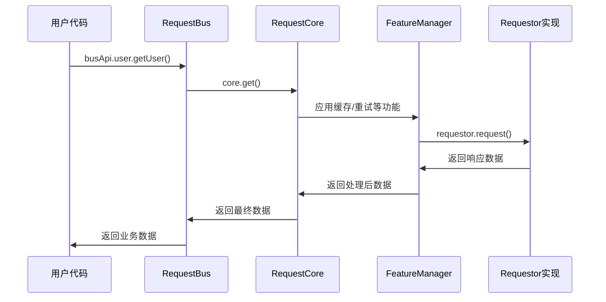
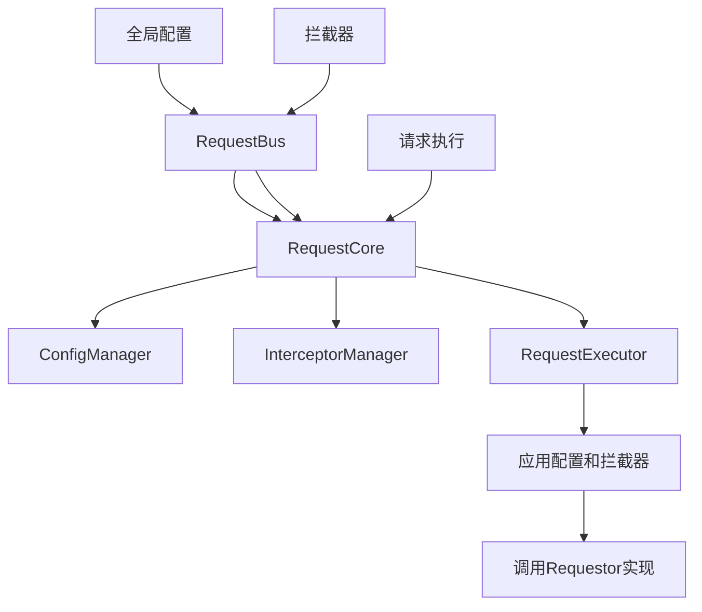

# 架构设计

## 📖 概述

本请求库采用**分层架构**和**依赖倒置原则**，构建了一个可扩展、可维护的前端 HTTP 请求解决方案。整个架构围绕**抽象接口**而非具体实现进行设计，实现了底层请求实现的可替换性，同时提供了丰富的高级功能。

## 🎯 设计理念

### 核心原则

1. **依赖倒置原则 (DIP)**
   - 高层模块不依赖低层模块，两者都依赖抽象
   - 抽象不依赖于细节，细节依赖于抽象
   - 通过 `Requestor` 接口实现解耦

2. **分层架构**
   - 每层有明确的职责边界
   - 层间通过接口进行通信
   - 支持功能的渐进式增强

3. **组合模式**
   - 使用管理器组合实现功能分离
   - 每个管理器专注于特定职责
   - 通过组合提供完整功能

4. **工厂模式**
   - 提供统一的实例创建接口
   - 支持依赖注入和配置
   - 简化使用者的创建复杂度

## 🏗️ 三层架构设计

### 架构层次图

```
┌─────────────────────────────────────────────┐
│               业务层 (request-bus)            │  ← 业务API封装、统一管理
├─────────────────────────────────────────────┤
│               核心层 (request-core)           │  ← 抽象接口、高级功能
├─────────────────────────────────────────────┤
│            实现层 (request-imp-*)            │  ← 具体HTTP实现
└─────────────────────────────────────────────┘
```

### 1. 实现层 (request-imp-*)

**职责**：提供具体的 HTTP 请求发送能力

**特征**：
- 实现统一的 `Requestor` 接口
- 封装底层HTTP库的差异性
- 提供标准化的错误处理
- 支持多种实现方式

**主要组件**：

```typescript
// 核心抽象接口
interface Requestor {
  request<T = unknown>(config: RequestConfig): Promise<T>
}

// Axios 实现
class AxiosRequestor implements Requestor {
  async request<T>(config: RequestConfig): Promise<T> {
    // 基于 axios 的具体实现
  }
}

// Fetch 实现  
class FetchRequestor implements Requestor {
  async request<T>(config: RequestConfig): Promise<T> {
    // 基于 fetch API 的具体实现
  }
}
```

**设计亮点**：
- 统一的错误处理和日志格式化
- 支持超时控制和请求取消
- 自动处理请求头和参数序列化
- 与上层完全解耦

### 2. 核心层 (request-core)

**职责**：定义抽象接口，提供与具体实现无关的高级功能

**特征**：
- 定义 `Requestor` 抽象接口
- 基于接口实现高级功能
- 采用管理器模式组织代码
- 提供完整的类型定义

**核心类架构**：

```typescript
class RequestCore implements ConvenienceExecutor {
  // 管理器组合 - 职责分离
  private interceptorManager: InterceptorManager     // 拦截器管理
  private configManager: ConfigManager               // 配置管理  
  private requestExecutor: RequestExecutor           // 请求执行
  private convenienceMethods: ConvenienceMethods     // 便利方法
  private featureManager: FeatureManager             // 功能管理

  constructor(private requestor: Requestor) {
    // 依赖注入，接收抽象接口实例
  }
}
```

**管理器职责分工**：

| 管理器 | 职责 | 核心功能 |
|--------|------|----------|
| `InterceptorManager` | 拦截器管理 | 请求前后的钩子处理 |
| `ConfigManager` | 配置管理 | 全局配置的存储和合并 |
| `RequestExecutor` | 请求执行 | 实际请求的执行和协调 |
| `ConvenienceMethods` | 便利方法 | GET、POST 等快捷方法 |
| `FeatureManager` | 功能管理 | 缓存、重试、并发等高级功能 |

**高级功能特性**：
- **请求缓存**：内存级缓存，支持 TTL 和自定义缓存键
- **请求重试**：可配置重试次数和延迟策略
- **并发控制**：支持请求串行和并行控制
- **拦截器**：请求/响应/错误拦截处理
- **链式调用**：RequestBuilder 模式支持

### 3. 业务层 (request-bus)

**职责**：集成核心层和实现层，提供业务相关的 API 管理

**特征**：
- 整合核心功能和业务逻辑
- 提供 API 注册和管理机制
- 支持运行时实现切换
- 集成公司内部协议规范

**核心类设计**：

```typescript
class RequestBus {
  private apiMap: Map<string, ApiInstance> = new Map()
  private requestCore: RequestCore
  
  constructor(requestCore: RequestCore) {
    this.requestCore = requestCore
  }
  
  // API 管理
  register<T>(name: string, apiClass: ApiClass<T>): T
  getApi<T>(name: string): T | undefined
  requireApi<T>(name: string): T
  
  // 实现切换
  switchImplementation(implementation: RequestImplementation): void
  
  // 全局管理
  setGlobalConfig(config: GlobalConfig): void
  addInterceptor(interceptor: RequestInterceptor): void
}
```

**主要功能**：
- **API 注册机制**：统一管理业务 API 类
- **实现动态切换**：运行时切换 axios/fetch 实现
- **全局配置管理**：统一的配置和拦截器管理
- **开发者工具**：调试模式、统计信息、帮助信息
- **工厂方法**：支持树摇优化的实例创建

## 🔗 依赖倒置原则的应用

### 传统依赖关系（不推荐）

```
RequestCore ──依赖──> AxiosRequestor
     ↑                     ↑
   难以测试              具体实现
```

### 依赖倒置后的关系（当前架构）

```
RequestCore ──依赖──> Requestor（抽象接口）
     ↑                     ↑
   易于测试                 ↑
                    实现此接口
                    AxiosRequestor
                    FetchRequestor
```

### 关键优势

1. **可扩展性**：新增实现只需实现 `Requestor` 接口
2. **可测试性**：可以轻松 mock `Requestor` 接口进行单元测试
3. **可维护性**：核心逻辑与具体实现解耦
4. **可替换性**：运行时可以无缝切换不同实现

## ⚙️ 组件交互流程

### 请求执行流程



### 配置和拦截器传递



## 🔧 扩展和定制

### 添加新的实现层

```typescript
// 1. 实现 Requestor 接口
class CustomRequestor implements Requestor {
  async request<T>(config: RequestConfig): Promise<T> {
    // 自定义实现逻辑
    return customHttpLib.request(config) as Promise<T>
  }
}

// 2. 注册到工厂
RequestCoreFactory.register('custom', () => new CustomRequestor())

// 3. 使用新实现
const bus = createRequestBus('custom')
```

### 扩展功能管理器

```typescript
// 1. 创建新的功能管理器
class SecurityManager {
  constructor(private requestor: Requestor) {}
  
  async requestWithSecurity<T>(config: RequestConfig): Promise<T> {
    // 添加安全相关逻辑
    const secureConfig = this.addSecurityHeaders(config)
    return this.requestor.request<T>(secureConfig)
  }
}

// 2. 集成到 RequestCore
class RequestCore {
  private securityManager: SecurityManager
  
  constructor(requestor: Requestor) {
    this.securityManager = new SecurityManager(requestor)
  }
}
```

## 📊 架构优势总结

### 技术优势

1. **高内聚低耦合**：每个层次和组件都有明确职责
2. **易于测试**：接口抽象使得 Mock 测试变得简单
3. **可扩展**：新功能可以通过新管理器或新实现层添加
4. **可维护**：清晰的架构边界降低维护成本

### 业务优势

1. **统一API**：为不同HTTP库提供统一的使用体验
2. **渐进增强**：可以根据需要选择功能层次
3. **运行时切换**：支持A/B测试和灾难恢复
4. **企业定制**：业务层可以集成公司特定规范

### 开发体验

1. **类型安全**：完整的 TypeScript 类型定义
2. **智能提示**：良好的 IDE 支持
3. **调试友好**：统一的日志格式和错误处理
4. **文档完善**：每层都有详细的文档说明

## 🔮 未来演进方向

1. **微服务支持**：支持服务发现和负载均衡
2. **插件系统**：更灵活的功能扩展机制
3. **性能监控**：集成请求性能监控和分析
4. **离线支持**：支持离线缓存和同步机制

这种架构设计确保了请求库既能满足当前需求，又具备良好的扩展性和可维护性，为长期的技术演进奠定了坚实基础。
