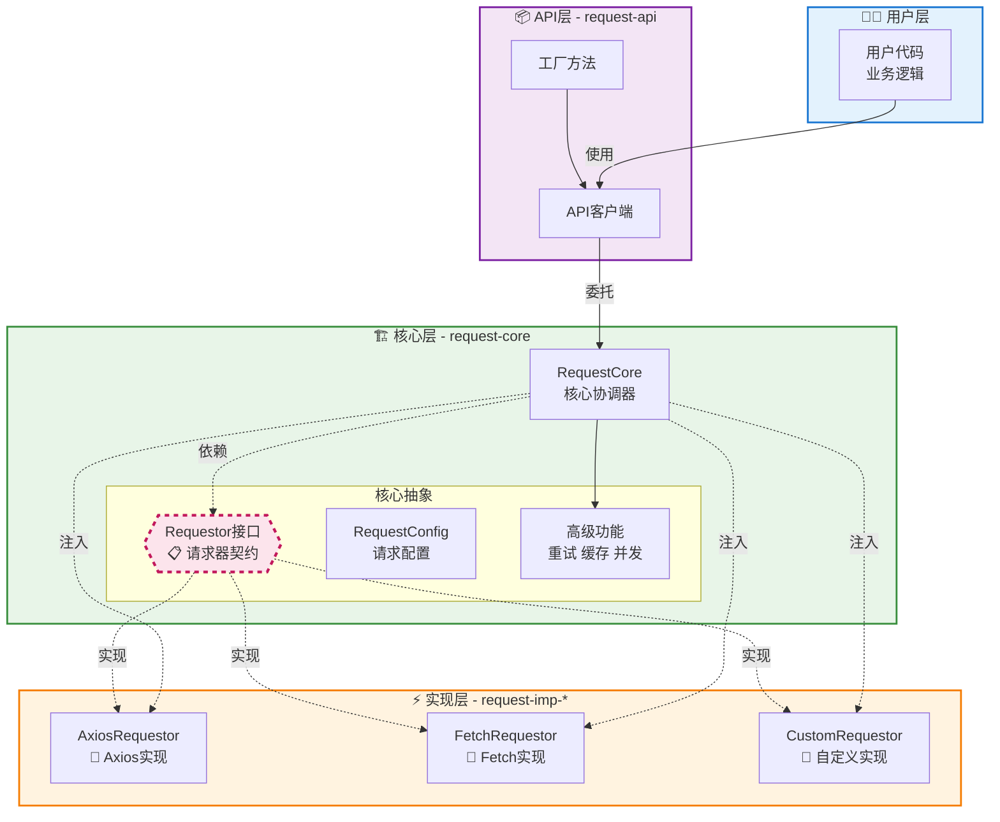

# 架构设计

## 1. 简介

### 背景

虽然前端具有诸多成熟的请求库，但在实际项目开发中发现，它们很难完全契合实际的开发需求。

**axios**

axios 虽然很成熟，但它只是一个基础库，没有提供诸多的上层功能，比如：

1. 请求重试
2. 请求缓存
3. 请求幂等
4. 请求串行
5. 请求并发
6. ...

**VueRequest / SWR**

它们虽然提供的功能很多，但仍然存在诸多问题：

1. 与上层框架过度绑定导致开发场景受限，也无法提供统一的 API
2. 成熟度不够，issue 的回复也难以做到及时，存在一定风险
3. 它们没有聚合基础请求库，仍然需要手动整合

**除此之外更重要的是**

公共库不包含公司内部制定的协议规范，即便使用公共库，也必须针对它们做二次封装。

**综上，需要自行封装一套适配公司业务的前端请求库**

## 2. 技术栈与环境

- **包管理器:** pnpm (利用其 workspace 功能管理多包项目)
- **语言:** TypeScript (提供类型安全和接口定义能力)
- **核心依赖 (可选):**
  - `axios` 或 `fetch` (作为底层请求实现)
  - `spark-md5` (用于请求哈希，实现幂等性)
- **开发环境:** Node.js (LTS 版本), pnpm

## 3. 库结构的宏观设计（架构设计）

### 初始设计


整个库结构包含三层，从下往上依次是：

- `请求实现层（request-imp）`： 提供请求基本功能
- `request-core`： 提供网络上层控制，比如请求串行、请求并行、请求重试、请求防重等功能
- `request-api`： 为请求绑定业务功能，该层接入公司内部协议规范和接口文档，向外提供业务接口 API

> 层是一种对代码结构的逻辑划分，在具体实现上可以有多种方式：
>
> - 每个层一个 monorepo 子包
> - 每个层一个子文件夹
> - ...

### **<font style="color:rgb(0, 0, 0);">优化设计</font>**

在三层中，请求实现层的实现有多种方式：

- 基于`fetch`原生
- 基于`axios`等第三方库
- ...

<font style="color:rgb(51, 51, 51);">这种实现的多样性可能导致这一次层的不稳定，而</font>`<font style="color:rgb(0, 0, 0);background-color:rgb(240, 240, 240);">request-imp</font>`<font style="color:rgb(51, 51, 51);">是基础层，它的不稳性会传导到上一层。</font>

<font style="color:rgb(51, 51, 51);">所</font><font style="color:rgb(51, 51, 51);">以必须寻求一种方案来隔离这种不稳定性。</font>

<font style="color:rgb(51, 51, 51);">我们可以基于 DIP（Dependence Inversion Principle，依赖倒置原则），彻底将</font>`<font style="color:rgb(0, 0, 0);background-color:rgb(240, 240, 240);">request-core</font>`<font style="color:rgb(51, 51, 51);">和请求的实现解耦，而</font>`<font style="color:rgb(0, 0, 0);background-color:rgb(240, 240, 240);">typescript</font>`<font style="color:rgb(51, 51, 51);">的类型系统让这一切的落地成为了可能。</font>

<font style="color:rgb(51, 51, 51);">于是结构演变为：</font>


### **<font style="color:rgb(26, 28, 30);">使用示例 (main.ts)</font>**

<font style="color:rgb(26, 28, 30);">最后，应用程序只需要调用 request-api 暴露的业务 API 即可，完全不需要关心底层的实现细节</font>

```typescript
import { createApiClient } from 'request-api'
import type { RequestCore } from 'request-api'
import { AxiosRequestor } from 'request-imp-axios'

// 1. 定义 API 类
class UserApi {
  constructor(private requestCore: RequestCore) {}

  async getUser(id: string) {
    return this.requestCore.get<User>(`/users/${id}`)
  }

  async getUserList() {
    return this.requestCore.get<User[]>('/users')
  }
}

// 2. 创建 API 客户端
const apiClient = createApiClient(
  {
    user: UserApi,
  },
  {
    requestor: new AxiosRequestor(), // 使用 Axios 实现
    globalConfig: {
      baseURL: 'https://jsonplaceholder.typicode.com',
      timeout: 5000,
    },
  }
)

// 3. 使用 API
const user = await apiClient.user.getUser('1')
console.log('User:', user)
```

### **架构图**



### **核心理念**

1. **分层**
   - `request-imp-*`: 提供具体的 HTTP 请求发送能力 (如 `request-axios-imp`, `request-fetch-imp`)。它们实现统一的 `Requestor` 接口
   - `request-core`: 核心层，定义 `Requestor` 接口，并基于此接口提供缓存、重试、幂等、并发/串行控制等与具体实现无关的高级功能。通过依赖注入接收 `request-imp` 的具体实现
   - `request-api`: api 层，负责注入 `request-imp` 实现到 `request-core`，调用 `request-core` 提供的功能，集成公司特定业务逻辑和协议规范，并暴露最终给应用使用的 API 函数
2. **依赖倒置 (DIP)**
   - `request-core` 不直接依赖具体的实现 (axios/fetch)，而是依赖抽象的 `Requestor` 接口。具体实现 (`request-imp-*`) 反过来依赖（实现）这个接口。这使得底层实现可以轻松替换，而不影响核心层和业务层。

## 4. **项目结构图**

```plain
packages/                           # 📁 包管理目录 - monorepo 架构的核心模块集合
├── request-core/                   # 🏗️ 核心层 - 请求库的核心抽象层，定义接口和通用功能
│   ├── src/                        # 📄 源代码目录 - 核心层的 TypeScript 源码
│   │   ├── cache/                  # 🗄️ 缓存系统 - 请求结果缓存的完整实现
│   │   │   ├── adapters/           # 存储适配器 - 支持多种存储方案
│   │   │   │   ├── indexeddb-adapter.ts    # IndexedDB 存储适配器
│   │   │   │   ├── local-storage-adapter.ts # LocalStorage 存储适配器
│   │   │   │   ├── memory-adapter.ts       # 内存存储适配器
│   │   │   │   └── websql-adapter.ts       # WebSQL 存储适配器
│   │   │   ├── cache-key-generator.ts      # 缓存键生成器 - 生成唯一缓存标识
│   │   │   ├── index.ts            # 缓存模块导出文件
│   │   │   ├── README.md           # 缓存系统说明文档
│   │   │   ├── storage-adapter.ts  # 存储适配器抽象接口
│   │   │   └── strategies.ts       # 缓存策略定义 - TTL、LRU 等策略
│   │   ├── features/               # 🎯 高级功能模块 - 扩展功能实现
│   │   │   ├── cache.ts            # 缓存功能集成
│   │   │   ├── concurrent.ts       # 并发请求控制 - 防抖、节流、并发限制
│   │   │   └── retry.ts            # 重试机制 - 自动重试失败的请求
│   │   ├── managers/               # 🎛️ 管理器模块 - 核心功能的管理和协调
│   │   │   ├── config-manager.ts   # 配置管理器 - 全局和局部配置管理
│   │   │   ├── convenience-methods.ts # 便捷方法管理器 - GET、POST 等快捷方法
│   │   │   ├── feature-manager.ts  # 功能管理器 - 插件化功能的启用和管理
│   │   │   ├── index.ts            # 管理器模块导出
│   │   │   ├── interceptor-manager.ts # 拦截器管理器 - 请求/响应拦截器管理
│   │   │   └── request-executor.ts # 请求执行器 - 请求的核心执行逻辑
│   │   ├── utils/                  # 🛠️ 工具函数 - 通用工具和辅助函数
│   │   │   └── error-handler.ts    # 错误处理器 - 统一错误处理和转换
│   │   ├── core.ts                 # 🎯 核心主类 - RequestCore 的主要实现
│   │   ├── index.ts                # 📋 模块导出入口 - 对外暴露的 API
│   │   └── interface.ts            # 📝 接口定义 - TypeScript 类型和接口定义
│   ├── package.json                # 📋 包配置文件 - 核心层依赖和脚本定义
│   └── tsconfig.json               # TypeScript 配置文件
│
├── request-api/                    # 🎪 API层 - 业务API的组装和暴露层
│   ├── src/                        # 📄 源代码目录 - API层的业务逻辑实现
│   │   └── index.ts                # 🏭 工厂方法实现 - 创建 API 客户端的工厂函数
│   ├── package.json                # 📋 包配置 - 依赖 request-core，提供最终 API
│   ├── README.md                   # 📖 使用说明文档
│   └── tsconfig.json               # TypeScript 配置
│
├── request-imp-axios/              # 🌐 Axios 实现层 - 基于 Axios 的具体实现
│   ├── src/                        # 📄 源代码目录 - Axios 适配器实现
│   │   └── index.ts                # 🔌 Axios 适配器 - 实现 Requestor 接口
│   ├── package.json                # 📋 包配置 - 依赖 axios 和 request-core
│   ├── README.md                   # 📖 Axios 实现说明
│   └── tsconfig.json               # TypeScript 配置
│
└── request-imp-fetch/              # 🌍 Fetch 实现层 - 基于原生 Fetch API 的实现
    ├── src/                        # 📄 源代码目录 - Fetch 适配器实现
    │   └── index.ts                # 🔌 Fetch 适配器 - 原生 Fetch 的 Requestor 实现
    ├── package.json                # 📋 包配置 - 仅依赖 request-core，无外部 HTTP 库
    ├── README.md                   # 📖 Fetch 实现说明
    └── tsconfig.json               # TypeScript 配置
```
