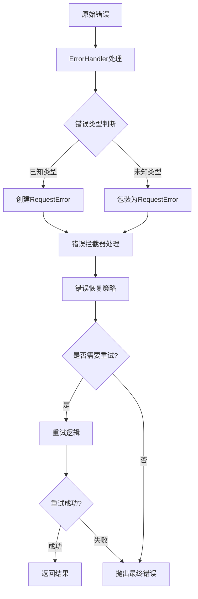
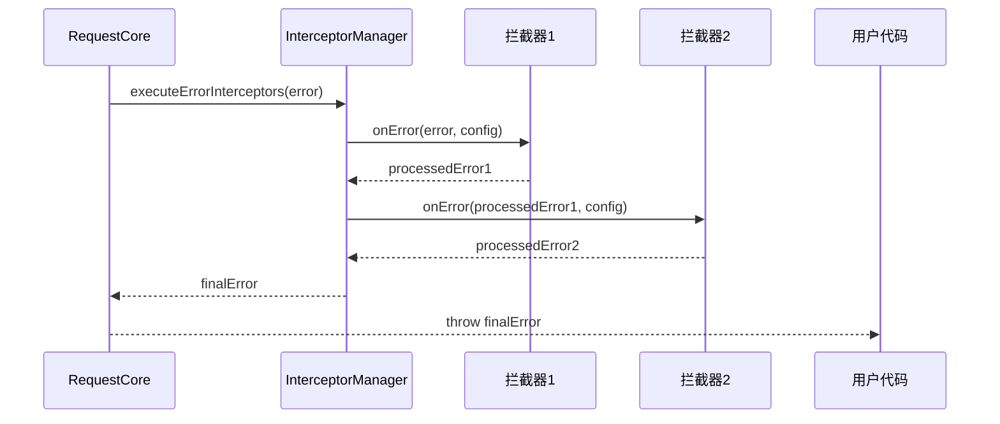

# 错误处理

## 📖 概述

错误处理是请求库设计中的关键组成部分。本请求库提供了完善的错误处理机制，包括统一的错误分类、详细的错误上下文信息、智能的错误建议以及灵活的错误拦截和恢复策略。本文档将详细介绍错误处理的各个方面。

## 🎯 错误处理核心特性

### 主要特点

1. **统一错误格式**：所有错误都基于 `RequestError` 类
2. **智能错误分类**：8种错误类型自动推断和分类
3. **详细上下文信息**：包含URL、方法、时间戳等完整信息
4. **自动建议生成**：为每种错误类型提供解决建议
5. **错误拦截机制**：支持错误拦截器进行自定义处理
6. **错误恢复策略**：集成重试机制和失败回调

### 错误处理架构



## 🏗️ RequestError 类详解

### 类结构

```typescript
export class RequestError extends Error {
  public readonly type: RequestErrorType          // 错误类型
  public readonly context: RequestErrorContext    // 错误上下文
  public readonly suggestion?: string             // 解决建议
  public readonly code?: string                   // 错误代码
  public readonly status?: number                 // HTTP状态码
  public readonly isHttpError: boolean            // 是否HTTP错误
  public readonly originalError?: unknown         // 原始错误对象
  
  constructor(message: string, options: RequestErrorOptions)
}
```

### 构造选项

```typescript
interface RequestErrorOptions {
  type?: RequestErrorType                    // 错误类型（自动推断）
  status?: number                           // HTTP状态码
  isHttpError?: boolean                     // 是否HTTP错误标记
  originalError?: unknown                   // 原始错误对象
  context?: Partial<RequestErrorContext>    // 上下文信息
  suggestion?: string                       // 自定义建议
  code?: string                            // 错误代码
}
```

### 错误上下文

```typescript
interface RequestErrorContext {
  url?: string                    // 请求URL
  method?: string                 // HTTP方法
  duration?: number               // 请求耗时
  timestamp: number               // 错误发生时间戳
  userAgent?: string              // 用户代理信息
  tag?: string                    // 请求标签
  metadata?: Record<string, unknown> // 额外元数据
}
```

### 实用方法

#### 格式化错误信息

```typescript
// 用户友好的错误信息显示
const error = new RequestError('Network connection failed', {
  type: RequestErrorType.NETWORK_ERROR,
  context: {
    url: '/api/users',
    method: 'GET',
    timestamp: Date.now()
  }
})

const displayMessage = error.toDisplayMessage()
console.log(displayMessage)
// 输出：
// 错误: Network connection failed
// 建议: 请检查网络连接或服务器是否可访问
// URL: /api/users
```

#### 转换为JSON

```typescript
// 用于日志记录和错误追踪
const errorData = error.toJSON()
console.log(JSON.stringify(errorData, null, 2))
// 输出完整的错误信息，包括堆栈信息
```

## 🔍 错误类型分类

### 错误类型枚举

```typescript
enum RequestErrorType {
  NETWORK_ERROR = 'NETWORK_ERROR',       // 网络连接错误
  HTTP_ERROR = 'HTTP_ERROR',             // HTTP状态码错误
  TIMEOUT_ERROR = 'TIMEOUT_ERROR',       // 请求超时错误
  VALIDATION_ERROR = 'VALIDATION_ERROR', // 配置验证错误
  CACHE_ERROR = 'CACHE_ERROR',           // 缓存操作错误
  CONCURRENT_ERROR = 'CONCURRENT_ERROR', // 并发控制错误
  RETRY_ERROR = 'RETRY_ERROR',           // 重试逻辑错误
  UNKNOWN_ERROR = 'UNKNOWN_ERROR'        // 未知错误
}
```

### 详细错误类型说明

#### 1. 网络错误 (NETWORK_ERROR)

**触发条件**：
- 网络连接失败
- DNS解析失败
- 连接被拒绝
- CORS跨域错误

**常见场景**：
```typescript
// 网络断开
fetch('/api/users') // 抛出 NETWORK_ERROR

// CORS错误
fetch('https://other-domain.com/api') // 可能抛出 NETWORK_ERROR

// DNS错误
fetch('https://non-existent-domain.com/api') // 抛出 NETWORK_ERROR
```

**自动建议**：
- "请检查网络连接或服务器是否可访问"

#### 2. HTTP错误 (HTTP_ERROR)

**触发条件**：
- 4xx客户端错误 (400-499)
- 5xx服务器错误 (500-599)

**状态码分类处理**：
```typescript
// 不同状态码的特定建议
switch (error.status) {
  case 400: // Bad Request
    suggestion = "请检查请求参数格式是否正确"
    break
  case 401: // Unauthorized
    suggestion = "认证失败，请检查token或登录状态"
    break
  case 403: // Forbidden
    suggestion = "权限不足，请检查用户权限设置"
    break
  case 404: // Not Found
    suggestion = "请检查请求URL是否正确"
    break
  case 429: // Too Many Requests
    suggestion = "请求过于频繁，请稍后再试"
    break
  case 500: // Internal Server Error
    suggestion = "服务器错误，请稍后重试或联系管理员"
    break
}
```

#### 3. 超时错误 (TIMEOUT_ERROR)

**触发条件**：
- 请求超时
- 手动取消请求（AbortController）

**区分超时类型**：
```typescript
// 自动超时
const error1 = ErrorHandler.createTimeoutError(
  'Request timeout after 5000ms',
  { url: '/api/data', method: 'GET', timeout: 5000 }
)

// 手动取消
const error2 = ErrorHandler.createTimeoutError(
  'Request aborted',
  { url: '/api/data', method: 'GET' }
)
```

**自动建议**：
- "请求超时，可以尝试增加timeout值或检查网络状况"

#### 4. 验证错误 (VALIDATION_ERROR)

**触发条件**：
- 请求配置参数无效
- 必填字段缺失
- 参数格式错误

**验证场景**：
```typescript
// URL缺失
await core.request({ method: 'GET' }) // 抛出 VALIDATION_ERROR

// 无效的HTTP方法
await core.request({ 
  url: '/api/users', 
  method: 'INVALID' as any 
}) // 抛出 VALIDATION_ERROR

// 超时值无效
await core.request({ 
  url: '/api/users', 
  method: 'GET',
  timeout: -1000 
}) // 抛出 VALIDATION_ERROR
```

#### 5. 其他错误类型

- **缓存错误 (CACHE_ERROR)**：缓存存储失败、清理异常
- **并发错误 (CONCURRENT_ERROR)**：并发请求管理失败
- **重试错误 (RETRY_ERROR)**：重试策略配置错误
- **未知错误 (UNKNOWN_ERROR)**：无法分类的异常错误

## 🛠️ ErrorHandler 工具类

### 核心方法

#### 1. wrapError - 通用错误包装

```typescript
static wrapError(
  error: unknown,
  context: {
    url: string
    method: string
    message?: string
  }
): RequestError
```

**使用场景**：
```typescript
try {
  // 一些可能抛出异常的操作
  const result = await someOperation()
} catch (error) {
  // 包装为标准 RequestError
  throw ErrorHandler.wrapError(error, {
    url: '/api/users',
    method: 'GET',
    message: '用户数据获取失败'
  })
}
```

#### 2. createHttpError - 创建HTTP错误

```typescript
static createHttpError(
  status: number,
  message: string,
  context: {
    url: string
    method: string
    originalError?: unknown
  }
): RequestError
```

**使用示例**：
```typescript
// Axios实现中的使用
if (axiosError.response) {
  const status = axiosError.response.status
  const statusText = axiosError.response.statusText
  throw ErrorHandler.createHttpError(
    status,
    `HTTP ${status}: ${statusText}`,
    {
      url: config.url,
      method: config.method,
      originalError: axiosError
    }
  )
}
```

#### 3. createNetworkError - 创建网络错误

```typescript
static createNetworkError(
  message: string,
  context: {
    url: string
    method: string
    originalError?: unknown
  }
): RequestError
```

#### 4. createTimeoutError - 创建超时错误

```typescript
static createTimeoutError(
  message: string,
  context: {
    url: string
    method: string
    timeout?: number
    originalError?: unknown
  }
): RequestError
```

### 错误类型推断

ErrorHandler具有智能的错误类型推断能力：

```typescript
private static inferErrorType(error: Error): RequestErrorType {
  const message = error.message.toLowerCase()
  
  // 网络相关错误优先级高
  if (message.includes('network') || 
      message.includes('fetch') || 
      message.includes('connection') ||
      message.includes('cors')) {
    return RequestErrorType.NETWORK_ERROR
  }
  
  // 超时错误
  if (message.includes('timeout') || error.name === 'AbortError') {
    return RequestErrorType.TIMEOUT_ERROR
  }
  
  return RequestErrorType.UNKNOWN_ERROR
}

## 🔧 错误拦截器

### 拦截器接口

```typescript
interface RequestInterceptor {
  onError?: (error: RequestError, config: RequestConfig) => RequestError | Promise<RequestError>
}
```

### 错误拦截器执行流程



### 错误拦截器最佳实践

#### 1. 认证错误处理

```typescript
const authErrorInterceptor: RequestInterceptor = {
  onError: async (error, config) => {
    // 处理401认证失败
    if (error.status === 401) {
      try {
        // 尝试刷新token
        await refreshAuthToken()
        
        // 提示重试
        throw new RequestError('Authentication refreshed, please retry', {
          type: RequestErrorType.HTTP_ERROR,
          code: 'AUTH_TOKEN_REFRESHED',
          suggestion: '认证信息已更新，请重新发起请求'
        })
      } catch (refreshError) {
        // 刷新失败，跳转登录
        redirectToLogin()
        throw new RequestError('Authentication failed', {
          type: RequestErrorType.HTTP_ERROR,
          status: 401,
          code: 'AUTH_REFRESH_FAILED',
          suggestion: '请重新登录'
        })
      }
    }
    
    // 其他错误直接抛出
    throw error
  }
}
```

#### 2. 业务错误处理

```typescript
const businessErrorInterceptor: RequestInterceptor = {
  onError: (error, config) => {
    // 处理特定的业务错误码
    if (error.status === 400 && error.code === 'BUSINESS_RULE_VIOLATION') {
      throw new RequestError('业务规则验证失败', {
        type: RequestErrorType.VALIDATION_ERROR,
        originalError: error,
        suggestion: '请检查输入数据是否符合业务规则',
        context: {
          ...error.context,
          businessContext: '数据验证失败'
        }
      })
    }
    
    throw error
  }
}
```

#### 3. 错误统计和监控

```typescript
const errorMonitoringInterceptor: RequestInterceptor = {
  onError: (error, config) => {
    // 记录错误统计
    errorMonitor.recordError({
      type: error.type,
      status: error.status,
      url: config.url,
      method: config.method,
      timestamp: error.context.timestamp,
      userAgent: error.context.userAgent
    })
    
    // 关键错误告警
    if (error.type === RequestErrorType.NETWORK_ERROR || 
        (error.status && error.status >= 500)) {
      alertSystem.sendAlert({
        level: 'ERROR',
        message: error.message,
        context: error.context
      })
    }
    
    throw error
  }
}
```

#### 4. 错误降级处理

```typescript
const fallbackInterceptor: RequestInterceptor = {
  onError: async (error, config) => {
    // 对于特定的API提供降级方案
    if (config.url.includes('/api/recommendations') && 
        error.type === RequestErrorType.NETWORK_ERROR) {
      
      // 使用缓存数据作为降级
      const fallbackData = await getCachedRecommendations()
      if (fallbackData) {
        console.warn('Using fallback data for recommendations API')
        return fallbackData
      }
      
      // 使用默认数据
      const defaultData = getDefaultRecommendations()
      console.warn('Using default data for recommendations API')
      return defaultData
    }
    
    throw error
  }
}
```

## 🔄 错误恢复策略

### 1. 重试机制

```typescript
// 自定义重试条件
const customRetryConfig: RetryConfig = {
  retries: 3,
  delay: 1000,
  backoffFactor: 2,
  jitter: 0.1,
  shouldRetry: (error: unknown, attempt: number) => {
    if (error instanceof RequestError) {
      // 网络错误和5xx错误重试
      if (error.type === RequestErrorType.NETWORK_ERROR ||
          error.type === RequestErrorType.TIMEOUT_ERROR ||
          (error.status && error.status >= 500)) {
        return true
      }
    }
    return false
  }
}

// 使用重试配置
const result = await core.requestWithRetry(
  { url: '/api/users', method: 'GET' },
  customRetryConfig
)
```

### 2. 断路器模式

```typescript
class CircuitBreaker {
  private failureCount = 0
  private lastFailureTime = 0
  private state: 'CLOSED' | 'OPEN' | 'HALF_OPEN' = 'CLOSED'
  
  constructor(
    private readonly failureThreshold = 5,
    private readonly resetTimeout = 60000
  ) {}
  
  async execute<T>(request: () => Promise<T>): Promise<T> {
    if (this.state === 'OPEN') {
      if (Date.now() - this.lastFailureTime > this.resetTimeout) {
        this.state = 'HALF_OPEN'
      } else {
        throw new RequestError('Circuit breaker is OPEN', {
          type: RequestErrorType.NETWORK_ERROR,
          code: 'CIRCUIT_BREAKER_OPEN',
          suggestion: '服务暂时不可用，请稍后重试'
        })
      }
    }
    
    try {
      const result = await request()
      
      if (this.state === 'HALF_OPEN') {
        this.state = 'CLOSED'
        this.failureCount = 0
      }
      
      return result
    } catch (error) {
      this.failureCount++
      this.lastFailureTime = Date.now()
      
      if (this.failureCount >= this.failureThreshold) {
        this.state = 'OPEN'
      }
      
      throw error
    }
  }
}
```

### 3. 超时退避

```typescript
class TimeoutBackoffStrategy {
  private timeoutMultipliers = new Map<string, number>()
  
  getTimeout(url: string, baseTimeout: number): number {
    const multiplier = this.timeoutMultipliers.get(url) || 1
    return Math.min(baseTimeout * multiplier, 30000) // 最大30秒
  }
  
  onTimeout(url: string): void {
    const currentMultiplier = this.timeoutMultipliers.get(url) || 1
    this.timeoutMultipliers.set(url, Math.min(currentMultiplier * 1.5, 5))
  }
  
  onSuccess(url: string): void {
    const currentMultiplier = this.timeoutMultipliers.get(url) || 1
    if (currentMultiplier > 1) {
      this.timeoutMultipliers.set(url, Math.max(currentMultiplier * 0.8, 1))
    }
  }
}
```

## 📊 错误监控和调试

### 错误收集器

```typescript
interface ErrorMetrics {
  errorCount: number
  errorRate: number
  errorsByType: Record<RequestErrorType, number>
  errorsByStatus: Record<number, number>
  topFailedUrls: Array<{ url: string, count: number }>
}

class ErrorCollector {
  private errors: Array<{
    error: RequestError
    timestamp: number
    config: RequestConfig
  }> = []
  
  collect(error: RequestError, config: RequestConfig): void {
    this.errors.push({
      error,
      timestamp: Date.now(),
      config
    })
    
    // 保留最近1000个错误
    if (this.errors.length > 1000) {
      this.errors.shift()
    }
  }
  
  getMetrics(timeRange?: number): ErrorMetrics {
    const cutoff = timeRange ? Date.now() - timeRange : 0
    const recentErrors = this.errors.filter(e => e.timestamp > cutoff)
    
    const errorsByType = recentErrors.reduce((acc, { error }) => {
      acc[error.type] = (acc[error.type] || 0) + 1
      return acc
    }, {} as Record<RequestErrorType, number>)
    
    return {
      errorCount: recentErrors.length,
      errorRate: recentErrors.length / Math.max(this.getTotalRequests(), 1),
      errorsByType,
      errorsByStatus: {},
      topFailedUrls: []
    }
  }
  
  private getTotalRequests(): number {
    return 100 // 示例值
  }
}
```

### 错误测试

```typescript
describe('Error Handling', () => {
  it('should create error with auto-inferred type', () => {
    const error = new RequestError('Network failed', {
      originalError: new Error('ECONNREFUSED'),
      context: { url: '/test', method: 'GET', timestamp: Date.now() }
    })
    
    expect(error.type).toBe(RequestErrorType.NETWORK_ERROR)
    expect(error.suggestion).toContain('网络连接')
  })
  
  it('should retry on network errors', async () => {
    let attemptCount = 0
    
    const mockRequest = async () => {
      attemptCount++
      if (attemptCount < 3) {
        throw new RequestError('Network error', {
          type: RequestErrorType.NETWORK_ERROR
        })
      }
      return { success: true }
    }
    
    // 模拟重试逻辑测试
    expect(attemptCount).toBeLessThan(4)
  })
})
```

## ✅ 最佳实践原则

### 分层错误处理

1. **网络层**：处理连接、超时等基础错误
2. **协议层**：处理HTTP状态码相关错误
3. **业务层**：处理业务逻辑相关错误
4. **展示层**：处理用户界面相关错误

### 用户体验优先

- **优雅降级**：提供备选方案和默认数据
- **清晰反馈**：提供明确的错误信息和解决建议
- **快速恢复**：通过重试和断路器快速恢复服务
- **渐进增强**：根据网络状况调整功能

## 🔍 总结

本请求库的错误处理机制提供了：

### 核心优势

1. **统一的错误格式**：基于 RequestError 类的一致结构
2. **智能错误分类**：8种错误类型的自动推断
3. **丰富的上下文信息**：完整的请求信息和执行上下文
4. **自动建议生成**：为每种错误类型提供解决建议
5. **灵活的拦截机制**：支持自定义错误处理策略
6. **完善的监控能力**：错误收集、统计和可视化

### 设计理念

- **错误即数据**：将错误视为有价值的数据进行处理
- **失败快速**：早发现、早处理、早恢复
- **用户体验优先**：始终考虑对用户体验的影响
- **可维护性**：清晰的错误分类和处理流程

这种设计确保了请求库不仅能正确处理各种异常情况，还能为开发者提供丰富的错误信息和恢复策略，大大提升了应用的健壮性和用户体验。