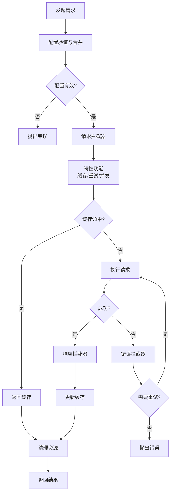
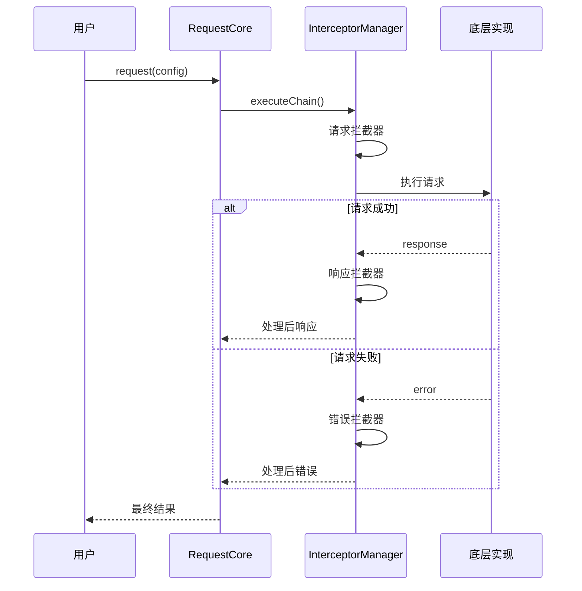

# 请求生命周期

## 概述

请求生命周期描述了从发起 HTTP 请求到收到响应的完整过程，包括配置处理、拦截器执行、特性功能应用和错误处理等关键环节。

## 生命周期流程

### 核心阶段

```
配置初始化 → 请求拦截 → 特性功能 → 请求执行 → 响应处理 → 清理
                                  ↓
                              错误处理（任何阶段）
```

### 流程图



## 阶段详解

### 1. 配置初始化

验证和合并请求配置：

```typescript
// 配置验证 → 配置合并 → URL 处理
this.configManager.validateRequestConfig(config)
const mergedConfig = this.configManager.mergeConfigs(config)
```

**关键点**：
- 验证必填字段（URL、method）
- 合并全局配置和请求配置（请求配置优先）
- 拼接 baseURL 和相对路径

### 2. 请求拦截器

修改请求配置的切入点：

```typescript
interface RequestInterceptor {
  onRequest?: (config: RequestConfig) => RequestConfig | Promise<RequestConfig>
  onResponse?: <T>(response: T, config: RequestConfig) => T | Promise<T>
  onError?: (error: RequestError, config: RequestConfig) => RequestError | Promise<RequestError>
}
```

**常见应用**：
- 添加认证 token
- 请求签名
- 日志记录
- 参数转换

**示例**：
```typescript
const authInterceptor: RequestInterceptor = {
  onRequest: (config) => ({
    ...config,
    headers: {
      ...config.headers,
      'Authorization': `Bearer ${getToken()}`
    }
  })
}
```

### 3. 特性功能

应用高级功能模块：

- **缓存**：生成缓存键 → 检查缓存 → 存储缓存（支持 TTL、LRU）
- **重试**：指数退避策略、条件重试（网络错误、5xx）
- **并发控制**：限制同时请求数
- **串行请求**：确保请求顺序执行
- **幂等性**：防止重复提交

### 4. 请求执行

调用底层 HTTP 实现：

```typescript
// 记录开始时间 → 发送请求 → 记录性能指标
const response = await this.implementation.request(config)
```

**性能监控**：请求耗时、成功率、错误率

### 5. 响应处理

执行响应拦截器链：

- 按注册顺序执行
- 链式处理响应数据
- 支持数据转换和状态检查

**常见应用**：
- 数据解包
- 格式转换
- 业务状态码检查
- 缓存更新

### 6. 错误处理

统一捕获和处理错误：

**错误类型**：
- `VALIDATION_ERROR`：配置参数无效
- `NETWORK_ERROR`：网络连接失败
- `TIMEOUT_ERROR`：请求超时
- `HTTP_ERROR`：HTTP 状态码错误
- `CACHE_ERROR`：缓存操作失败

**处理流程**：错误拦截器 → 重试检查 → 抛出最终错误

### 7. 清理资源

执行最终清理：
- 清理超时定时器
- 执行 onEnd 回调
- 释放相关资源

## 拦截器执行时序



### 拦截器实践

**认证拦截器**：
```typescript
{
  onRequest: (config) => ({ ...config, headers: { ...config.headers, Authorization: `Bearer ${token}` } }),
  onError: async (error) => {
    if (error.status === 401) {
      await refreshToken()
      return retry(error.config)
    }
    return error
  }
}
```

**日志拦截器**：
```typescript
{
  onRequest: (config) => {
    console.log(`Request: ${config.method} ${config.url}`)
    return config
  },
  onResponse: (response) => {
    console.log('Response received')
    return response
  },
  onError: (error) => {
    console.error(`Error: ${error.message}`)
    return error
  }
}
```

## 调试与监控

**启用调试**：
```typescript
const client = createRequestClient({
  debug: true  // 打印详细日志
})
```

**性能监控**：
```typescript
const perfInterceptor = {
  onRequest: (config) => {
    config._startTime = Date.now()
    return config
  },
  onResponse: (response, config) => {
    const duration = Date.now() - config._startTime
    console.log(`Request took ${duration}ms`)
    return response
  }
}
```

## 总结

请求生命周期通过 7 个阶段和灵活的拦截器机制，提供了完整的请求处理能力：

**核心优势**：
- 清晰的处理流程和职责分离
- 灵活的拦截器扩展机制
- 丰富的特性功能（缓存、重试、并发控制）
- 完善的错误处理和恢复策略
- 内置性能监控和调试支持
