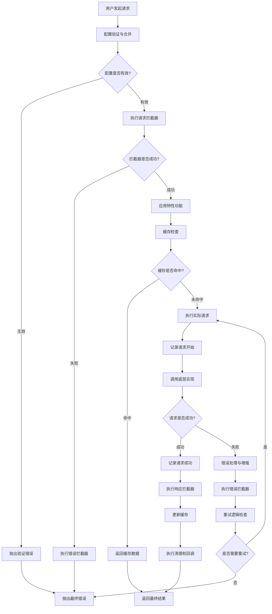
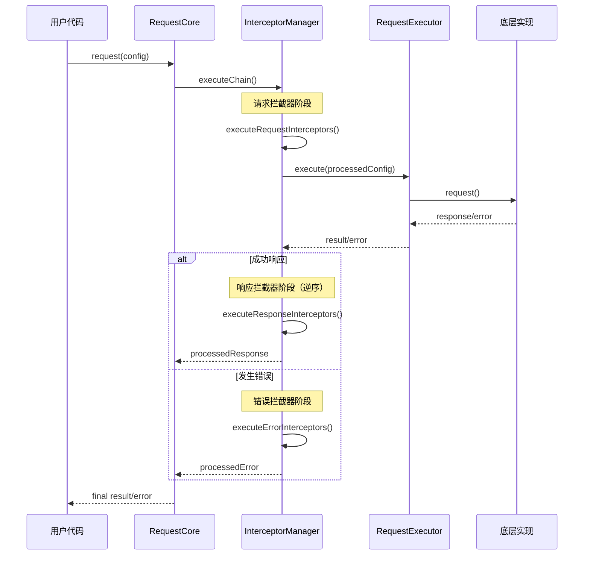

# 请求生命周期

## 📖 概述

请求生命周期是指从发起一个HTTP请求到最终收到响应（或错误）的完整过程。本请求库通过精心设计的多阶段处理流程，确保每个请求都能得到正确、可靠的处理。本文档将详细介绍请求生命周期的各个阶段、拦截器的执行时机以及错误处理机制。

## 🔄 生命周期概览

### 核心阶段

请求生命周期包含以下7个核心阶段：

```
1. 配置初始化 → 2. 请求拦截 → 3. 特性功能应用 → 4. 实际请求执行 
                                          ↓
7. 清理阶段 ← 6. 错误处理 ← 5. 响应处理 ← (响应返回/错误发生)
```

### 生命周期流程图



## 🎯 详细阶段分析

### 阶段1：配置初始化

**职责**：验证请求参数，合并全局配置和请求配置

**执行位置**：`RequestCore.request()` 方法开始

```typescript
async request<T>(config: RequestConfig): Promise<T> {
  // 1. 验证请求配置
  this.configManager.validateRequestConfig(config)
  
  // 2. 合并全局配置和请求配置
  const mergedConfig = this.configManager.mergeConfigs(config)
  
  // ... 继续后续处理
}
```

**关键处理**：
- **配置验证**：检查必填字段（URL、method）
- **参数校验**：验证超时时间、请求头格式等
- **配置合并**：全局配置 + 请求配置，请求配置优先级更高
- **URL处理**：拼接baseURL和相对路径

**可能的错误**：
- `VALIDATION_ERROR`：配置参数无效
- `INVALID_URL`：URL格式错误
- `INVALID_METHOD`：HTTP方法不支持

### 阶段2：请求拦截器执行

**职责**：执行用户定义的请求前拦截器，允许修改请求配置

**执行位置**：`InterceptorManager.executeChain()`

```typescript
async executeChain<T>(
  config: RequestConfig,
  executor: (config: RequestConfig) => Promise<T>
): Promise<T> {
  // 执行请求拦截器
  try {
    processedConfig = await this.executeRequestInterceptors(config)
  } catch (error) {
    // 请求拦截器出错也会执行错误拦截器
    const processedError = await this.executeErrorInterceptors(error, config)
    throw processedError
  }
  
  // ... 继续执行请求
}
```

**拦截器类型**：
```typescript
interface RequestInterceptor {
  onRequest?: (config: RequestConfig) => RequestConfig | Promise<RequestConfig>
  onResponse?: <T>(response: T, config: RequestConfig) => T | Promise<T>
  onError?: (error: RequestError, config: RequestConfig) => RequestError | Promise<RequestError>
}
```

**执行顺序**：
- 请求拦截器：**按注册顺序**执行
- 每个拦截器可以修改配置并传递给下一个拦截器
- 支持异步拦截器

**常见用途**：
- **身份认证**：添加Authorization header
- **请求签名**：计算和添加签名参数
- **日志记录**：记录请求开始信息
- **参数转换**：数据格式化和编码

**示例**：
```typescript
// 认证拦截器
const authInterceptor: RequestInterceptor = {
  onRequest: (config) => {
    config.headers = {
      ...config.headers,
      'Authorization': `Bearer ${getToken()}`
    }
    return config
  }
}
```

### 阶段3：特性功能应用

**职责**：应用高级功能，如缓存检查、并发控制等

**执行位置**：`FeatureManager` 各功能模块

#### 缓存检查

```typescript
async requestWithCache<T>(config: RequestConfig, cacheConfig?: CacheConfig): Promise<T> {
  // 1. 生成缓存键
  const cacheKey = this.generateCacheKey(config, cacheConfig?.key)
  
  // 2. 检查缓存
  const cached = this.getCachedItem<T>(cacheKey)
  if (cached && !this.isExpired(cached)) {
    return this.cloneData(cached.data, cacheConfig?.clone)
  }
  
  // 3. 缓存未命中，执行请求
  const result = await this.requestor.request<T>(config)
  
  // 4. 存储缓存
  this.setCachedItem(cacheKey, result, cacheConfig?.ttl)
  return result
}
```

**缓存策略**：
- **键生成**：基于URL、方法、参数生成唯一键
- **TTL检查**：时间戳验证缓存是否过期
- **LRU清理**：最近最少使用策略清理旧缓存

#### 重试逻辑

```typescript
async requestWithRetry<T>(config: RequestConfig, retryConfig?: RetryConfig): Promise<T> {
  const maxRetries = retryConfig?.retries || 3
  
  for (let attempt = 0; attempt <= maxRetries; attempt++) {
    try {
      return await this.requestor.request<T>(config)
    } catch (error) {
      // 最后一次尝试或不应重试
      if (attempt === maxRetries || !this.shouldRetry(error, attempt)) {
        throw error
      }
      
      // 计算退避延迟
      const delay = this.calculateDelay(attempt, retryConfig)
      await this.sleep(delay)
    }
  }
}
```

**重试策略**：
- **指数退避**：延迟时间递增（1s、2s、4s...）
- **随机抖动**：避免惊群效应
- **条件重试**：只对网络错误和5xx错误重试

### 阶段4：实际请求执行

**职责**：调用底层HTTP实现发送请求，记录性能指标

**执行位置**：`RequestExecutor.execute()`

```typescript
async execute<T>(config: RequestConfig): Promise<T> {
  const context = this.createExecutionContext(config)
  
  try {
    // 1. 记录开始时间和执行开始回调
    this.logRequestStart(context)
    this.executeOnStartCallback(context)
    
    // 2. 调用底层实现执行请求
    const result = await this.requestor.request<T>(config)
    const duration = this.getDuration(context)
    
    // 3. 记录成功和执行结束回调
    this.logRequestSuccess(context, duration)
    this.executeOnEndCallback(context, duration)
    
    return result
    
  } catch (error) {
    // 4. 错误处理和增强
    const duration = this.getDuration(context)
    const enhancedError = this.enhanceError(error, context, duration)
    
    this.logRequestError(context, enhancedError, duration)
    this.executeOnErrorCallback(context, enhancedError, duration)
    
    throw enhancedError
  }
}
```

**性能监控**：
- **开始时间**：记录请求开始的精确时间戳
- **持续时间**：计算请求总耗时
- **回调执行**：执行用户定义的性能监控回调
- **日志记录**：统一格式的请求日志

### 阶段5：响应处理

**职责**：执行响应拦截器，处理响应数据

**执行位置**：`InterceptorManager.executeResponseInterceptors()`

```typescript
private async executeResponseInterceptors<T>(
  response: T, 
  config: RequestConfig
): Promise<T> {
  let processedResponse = response
  
  // 响应拦截器逆序执行
  for (let i = this.interceptors.length - 1; i >= 0; i--) {
    const interceptor = this.interceptors[i]
    if (interceptor.onResponse) {
      try {
        processedResponse = await interceptor.onResponse(processedResponse, config)
      } catch (error) {
        // 响应拦截器出错会转为错误处理
        throw new RequestError('Response interceptor failed', {
          originalError: error,
          context: { url: config.url, method: config.method, timestamp: Date.now() }
        })
      }
    }
  }
  
  return processedResponse
}
```

**执行特点**：
- **逆序执行**：后注册的拦截器先执行（类似栈结构）
- **链式处理**：每个拦截器处理上一个的结果
- **数据转换**：可以修改响应数据的格式和内容

**常见用途**：
- **数据解包**：提取嵌套的响应数据
- **格式转换**：日期字符串转Date对象
- **状态检查**：检查业务状态码
- **缓存更新**：更新本地缓存数据

### 阶段6：错误处理

**职责**：捕获和处理请求过程中的各种错误

**错误来源**：
- **配置验证错误**：参数格式不正确
- **拦截器错误**：拦截器执行失败
- **网络错误**：连接失败、超时等
- **HTTP错误**：4xx、5xx状态码
- **业务错误**：响应拦截器抛出的错误

#### 错误拦截器执行

```typescript
private async executeErrorInterceptors(
  error: RequestError, 
  config: RequestConfig
): Promise<RequestError> {
  let processedError = error
  
  // 按注册顺序执行错误拦截器
  for (const interceptor of this.interceptors) {
    if (interceptor.onError) {
      try {
        processedError = await interceptor.onError(processedError, config)
      } catch (interceptorError) {
        // 错误拦截器本身出错，使用原始错误
        console.warn('Error interceptor failed:', interceptorError)
      }
    }
  }
  
  return processedError
}
```

**错误类型分类**：
```typescript
enum RequestErrorType {
  NETWORK_ERROR = 'NETWORK_ERROR',       // 网络连接错误
  HTTP_ERROR = 'HTTP_ERROR',             // HTTP状态码错误  
  TIMEOUT_ERROR = 'TIMEOUT_ERROR',       // 请求超时
  VALIDATION_ERROR = 'VALIDATION_ERROR', // 配置验证错误
  CACHE_ERROR = 'CACHE_ERROR',           // 缓存操作错误
  RETRY_ERROR = 'RETRY_ERROR',           // 重试逻辑错误
  UNKNOWN_ERROR = 'UNKNOWN_ERROR'        // 未知错误
}
```

### 阶段7：清理阶段

**职责**：执行资源清理和最终回调

```typescript
finally {
  // 清理超时定时器
  if (timeoutId) {
    clearTimeout(timeoutId)
  }
  
  // 执行清理回调
  if (config.onEnd) {
    const duration = Date.now() - startTime
    try {
      config.onEnd(config, duration)
    } catch (error) {
      console.warn('onEnd callback failed:', error)
    }
  }
}
```

## 🔧 拦截器深入

### 拦截器执行时机



### 拦截器最佳实践

#### 认证拦截器

```typescript
const createAuthInterceptor = (tokenProvider: () => string): RequestInterceptor => ({
  onRequest: (config) => {
    const token = tokenProvider()
    if (token) {
      config.headers = {
        ...config.headers,
        'Authorization': `Bearer ${token}`
      }
    }
    return config
  },
  
  onError: async (error, config) => {
    // 401错误自动刷新token重试
    if (error.status === 401) {
      try {
        await refreshToken()
        throw new RequestError('Token refreshed, please retry', {
          code: 'TOKEN_REFRESHED'
        })
      } catch (refreshError) {
        redirectToLogin()
        throw error
      }
    }
    throw error
  }
})
```

#### 日志拦截器

```typescript
const createLoggingInterceptor = (logger: Logger): RequestInterceptor => ({
  onRequest: (config) => {
    logger.info('Request started', {
      url: config.url,
      method: config.method,
      timestamp: new Date().toISOString()
    })
    return config
  },
  
  onResponse: (response, config) => {
    logger.info('Request completed', {
      url: config.url,
      method: config.method,
      status: 'success'
    })
    return response
  },
  
  onError: (error, config) => {
    logger.error('Request failed', {
      url: config.url,
      method: config.method,
      error: error.message,
      type: error.type
    })
    throw error
  }
})
```

## 📊 监控和调试

### 性能监控

```typescript
// 性能监控拦截器
const createMetricsInterceptor = (collector: MetricsCollector): RequestInterceptor => {
  const startTimes = new WeakMap()
  
  return {
    onRequest: (config) => {
      startTimes.set(config, performance.now())
      return config
    },
    
    onResponse: (response, config) => {
      const startTime = startTimes.get(config)
      if (startTime) {
        const duration = performance.now() - startTime
        collector.recordSuccess({
          url: config.url,
          method: config.method,
          duration
        })
      }
      return response
    },
    
    onError: (error, config) => {
      const startTime = startTimes.get(config)
      if (startTime) {
        const duration = performance.now() - startTime
        collector.recordError({
          url: config.url,
          method: config.method,
          error: error.type,
          duration
        })
      }
      throw error
    }
  }
}
```

### 调试工具

```typescript
// 开启详细调试日志
const debugInterceptor: RequestInterceptor = {
  onRequest: (config) => {
    console.group(`🚀 [${config.method}] ${config.url}`)
    console.log('Request config:', config)
    console.groupEnd()
    return config
  },
  
  onResponse: (response, config) => {
    console.group(`✅ [${config.method}] ${config.url}`)
    console.log('Response:', response)
    console.groupEnd()
    return response
  },
  
  onError: (error, config) => {
    console.group(`❌ [${config.method}] ${config.url}`)
    console.error('Error:', error)
    console.log('Error context:', error.context)
    console.log('Suggestion:', error.suggestion)
    console.groupEnd()
    throw error
  }
}
```

## 🔍 总结

请求生命周期是本请求库的核心处理机制，通过精心设计的7个阶段确保每个请求都能得到正确处理：

### 关键特性

1. **配置验证**：严格的参数校验和错误提示
2. **拦截器链**：灵活的请求/响应/错误拦截机制
3. **特性功能**：缓存、重试、并发控制等高级功能
4. **错误处理**：完善的错误分类和处理机制
5. **性能监控**：详细的性能指标和调试信息

### 设计优势

- **可扩展性**：拦截器机制支持功能扩展
- **可观测性**：完整的日志和性能监控
- **容错性**：多层错误处理和恢复机制
- **高性能**：优化的缓存和并发控制策略

这种设计确保了请求库不仅功能强大，而且具备企业级应用所需的稳定性和可维护性。
