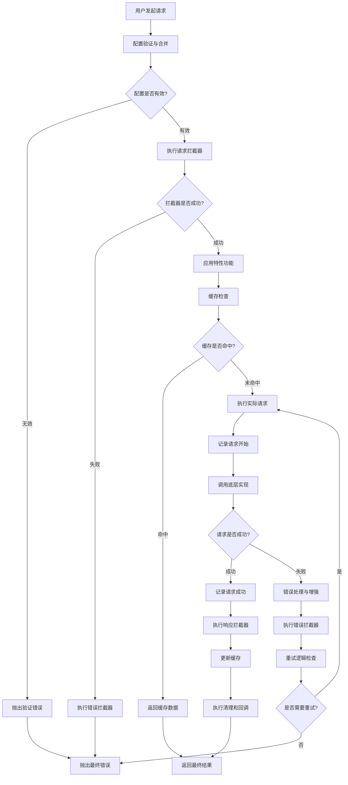
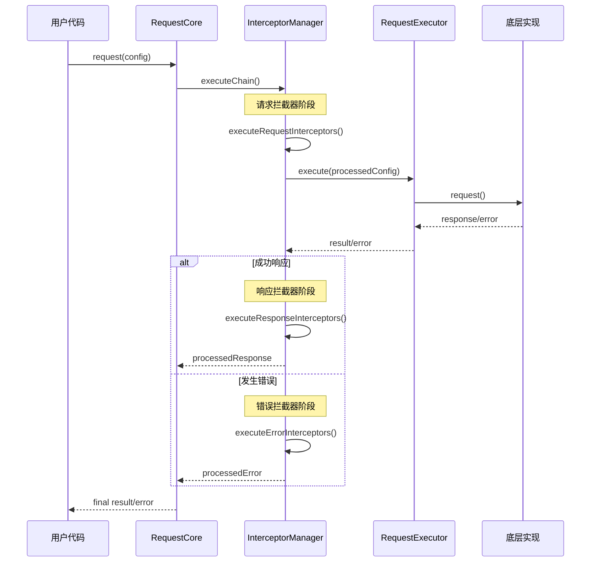

# 请求生命周期

## 概述

请求生命周期是指从发起 HTTP 请求到最终收到响应（或错误）的完整过程。本文档详细介绍请求生命周期的各个阶段、拦截器的执行时机以及错误处理机制。

## 生命周期概览

### 核心阶段

请求生命周期包含以下 7 个核心阶段：

```
1. 配置初始化 → 2. 请求拦截 → 3. 特性功能应用 → 4. 实际请求执行 
                                          ↓
7. 清理阶段 ← 6. 错误处理 ← 5. 响应处理 ← (响应返回/错误发生)
```

### 生命周期流程图



## 详细阶段分析

### 阶段 1：配置初始化

**职责**: 验证请求参数，合并全局配置和请求配置

**执行位置**: `RequestCore.request()` 方法开始

```typescript
async request<T>(config: RequestConfig): Promise<T> {
  // 1. 验证请求配置
  this.configManager.validateRequestConfig(config)
  
  // 2. 合并全局配置和请求配置
  const mergedConfig = this.configManager.mergeConfigs(config)
  
  // ... 继续后续处理
}
```

**关键处理**：
- **配置验证**: 检查必填字段（URL、method）
- **参数校验**: 验证超时时间、请求头格式等
- **配置合并**: 全局配置 + 请求配置，请求配置优先级更高
- **URL 处理**: 拼接 baseURL 和相对路径

**可能的错误**：
- `VALIDATION_ERROR`: 配置参数无效
- `INVALID_URL`: URL 格式错误
- `INVALID_METHOD`: HTTP 方法不支持

### 阶段 2：请求拦截器执行

**职责**: 执行用户定义的请求前拦截器，允许修改请求配置

**执行位置**: `InterceptorManager.executeChain()`

```typescript
async executeChain<T>(
  config: RequestConfig,
  executor: (config: RequestConfig) => Promise<T>
): Promise<T> {
  // 执行请求拦截器
  try {
    processedConfig = await this.executeRequestInterceptors(config)
  } catch (error) {
    // 请求拦截器出错也会执行错误拦截器
    const processedError = await this.executeErrorInterceptors(error, config)
    throw processedError
  }
  
  // ... 继续执行请求
}
```

**拦截器类型**：
```typescript
interface RequestInterceptor {
  onRequest?: (config: RequestConfig) => RequestConfig | Promise<RequestConfig>
  onResponse?: <T>(response: T, config: RequestConfig) => T | Promise<T>
  onError?: (error: RequestError, config: RequestConfig) => RequestError | Promise<RequestError>
}
```

**执行顺序**: 请求拦截器按注册顺序执行，每个拦截器可以修改配置并传递给下一个拦截器，支持异步拦截器。

**常见用途**：
- **身份认证**: 添加 Authorization header
- **请求签名**: 计算和添加签名参数
- **日志记录**: 记录请求开始信息
- **参数转换**: 数据格式化和编码

**示例**：
```typescript
// 认证拦截器
const authInterceptor: RequestInterceptor = {
  onRequest: (config) => {
    config.headers = {
      ...config.headers,
      'Authorization': `Bearer ${getToken()}`
    }
    return config
  }
}
```

### 阶段 3：特性功能应用

**职责**: 应用高级功能，如缓存检查、并发控制等

**执行位置**: `FeatureManager` 各功能模块

**缓存功能**: 生成缓存键 → 检查缓存 → 命中返回/未命中请求 → 存储缓存，支持 TTL 过期、LRU 清理策略

**重试功能**: 指数退避策略，条件重试（网络错误、5xx 错误），支持最大重试次数和延迟配置

### 阶段 4：实际请求执行

**职责**: 调用底层 HTTP 实现发送请求，记录性能指标

**执行位置**: `RequestExecutor.execute()`

**核心流程**：
1. 创建执行上下文，记录开始时间
2. 调用底层实现发送 HTTP 请求
3. 记录性能指标和执行回调
4. 错误时增强错误信息和上下文

**性能监控**: 记录请求耗时、执行回调、统一日志记录

### 阶段 5：响应处理

**职责**: 执行响应拦截器，处理响应数据

**执行位置**: `InterceptorManager.executeResponseInterceptors()`

```typescript
private async executeResponseInterceptors<T>(
  response: T, 
  config: RequestConfig
): Promise<T> {
  let processedResponse = response
  
  // 响应拦截器按注册顺序执行
  for (const interceptor of this.interceptors) {
    if (interceptor.onResponse) {
      try {
        processedResponse = await interceptor.onResponse(processedResponse, config)
      } catch (error) {
        throw new RequestError('Response interceptor failed', {
          originalError: error,
          context: { url: config.url, method: config.method }
        })
      }
    }
  }
  
  return processedResponse
}
```

**执行特点**：
- **按注册顺序执行**: 先注册的拦截器先执行
- **链式处理**: 每个拦截器处理上一个的结果
- **数据转换**: 可以修改响应数据的格式和内容

**常见用途**：
- **数据解包**: 提取嵌套的响应数据
- **格式转换**: 日期字符串转 Date 对象
- **状态检查**: 检查业务状态码
- **缓存更新**: 更新本地缓存数据

### 阶段 6：错误处理

**职责**: 捕获和处理请求过程中的各种错误

**错误来源**：
- **配置验证错误**: 参数格式不正确
- **拦截器错误**: 拦截器执行失败
- **网络错误**: 连接失败、超时等
- **HTTP 错误**: 4xx、5xx 状态码
- **业务错误**: 响应拦截器抛出的错误

**错误类型**: NETWORK_ERROR、HTTP_ERROR、TIMEOUT_ERROR、VALIDATION_ERROR、CACHE_ERROR 等

**处理流程**: 错误拦截器按注册顺序执行，可修改错误信息或执行恢复逻辑

### 阶段 7：清理阶段

**职责**: 执行资源清理和最终回调

清理超时定时器、执行 onEnd 回调、释放相关资源

## 拦截器深入

### 拦截器执行时机



### 拦截器最佳实践

**认证拦截器**：
- `onRequest`: 添加 Authorization header
- `onError`: 处理 401 错误，自动刷新 token

**日志拦截器**：
- `onRequest`: 记录请求开始信息
- `onResponse`: 记录请求成功
- `onError`: 记录请求错误详情

## 监控和调试

### 性能监控

通过拦截器收集请求耗时、成功率等指标，支持自定义性能数据收集器。

### 调试功能

- `debug: true` 配置开启详细日志
- 显示请求配置、响应数据、错误信息
- 提供错误建议和上下文信息

## 总结

请求生命周期是本请求库的核心处理机制，通过精心设计的 7 个阶段确保每个请求都能得到正确处理。

### 关键特性

1. **配置验证**: 严格的参数校验和错误提示
2. **拦截器链**: 灵活的请求/响应/错误拦截机制
3. **特性功能**: 缓存、重试、并发控制等高级功能
4. **错误处理**: 完善的错误分类和处理机制
5. **性能监控**: 详细的性能指标和调试信息

### 设计优势

- **可扩展性**: 拦截器机制支持功能扩展
- **可观测性**: 完整的日志和性能监控
- **容错性**: 多层错误处理和恢复机制
- **高性能**: 优化的缓存和并发控制策略
