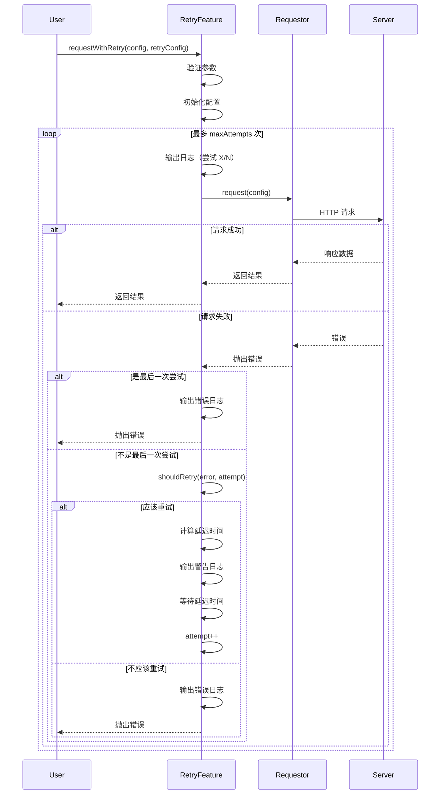
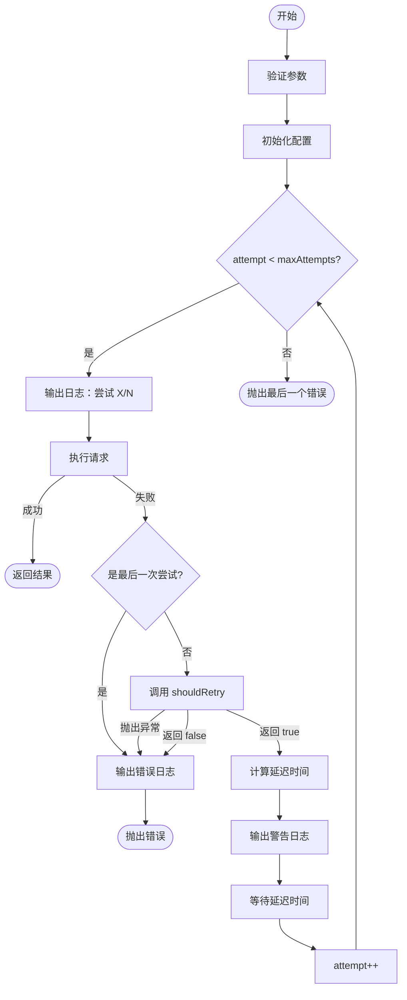

# 重试请求技术方案

## 1. 引言

在网络请求中，由于网络波动、服务器临时故障等原因，请求可能会失败。为了提高应用的健壮性和用户体验，需要在请求失败时自动重试。本方案旨在为 `request-core` 库设计并实现一个智能、灵活的请求重试功能。

## 2. 设计目标

- **智能性**: 自动识别可重试的错误类型，避免对永久性错误进行无意义的重试。
- **灵活性**: 支持自定义重试次数、延迟策略、重试条件等。
- **渐进式退避**: 支持指数退避和抖动机制，避免对服务器造成冲击。
- **可观测性**: 提供详细的日志输出，便于调试和监控。
- **易用性**: 提供合理的默认配置，同时允许用户自定义。

## 3. API 设计

通过 `RetryFeature` 类提供重试功能，用户可以通过配置 `RetryConfig` 来自定义重试行为。

### 3.1. 类型定义

```typescript
interface RetryConfig {
  retries: number                                          // 重试次数（不包括首次请求）
  delay?: number                                           // 基础延迟时间（毫秒），默认 1000ms
  backoffFactor?: number                                   // 退避因子，用于指数退避，默认 1（不退避）
  jitter?: number                                          // 抖动因子（0-1），默认 0（无抖动）
  shouldRetry?: (error: unknown, attempt: number) => boolean  // 自定义重试判断函数
}
```

### 3.2. 使用示例

```typescript
import { RetryFeature } from '@request-core';

const retryFeature = new RetryFeature(requestor);

// 基本使用：重试 3 次
const response1 = await retryFeature.requestWithRetry({
  url: '/api/data',
  method: 'GET'
}, {
  retries: 3
});

// 带延迟的重试：每次重试前等待 2 秒
const response2 = await retryFeature.requestWithRetry({
  url: '/api/data',
  method: 'GET'
}, {
  retries: 3,
  delay: 2000
});

// 指数退避：每次延迟时间翻倍
// 第1次重试：1000ms，第2次：2000ms，第3次：4000ms
const response3 = await retryFeature.requestWithRetry({
  url: '/api/data',
  method: 'GET'
}, {
  retries: 3,
  delay: 1000,
  backoffFactor: 2
});

// 指数退避 + 抖动：避免"惊群效应"
// 实际延迟 = baseDelay * backoffFactor^attempt + random(0, baseDelay * jitter)
const response4 = await retryFeature.requestWithRetry({
  url: '/api/data',
  method: 'GET'
}, {
  retries: 3,
  delay: 1000,
  backoffFactor: 2,
  jitter: 0.1  // 增加 0-10% 的随机抖动
});

// 自定义重试条件：只对 503 状态码重试
const response5 = await retryFeature.requestWithRetry({
  url: '/api/data',
  method: 'GET'
}, {
  retries: 3,
  shouldRetry: (error, attempt) => {
    if (error instanceof RequestError && error.status === 503) {
      return true;
    }
    return false;
  }
});
```

## 4. 实现思路

### 4.1. 核心组件

1. **`RetryFeature` (重试功能类)**:
   - 封装重试逻辑的核心类。
   - 依赖 `Requestor` 接口来执行实际的请求。

2. **`RetryConfig` (重试配置)**:
   - 定义重试行为的配置接口。
   - 包含重试次数、延迟策略、自定义判断函数等。

3. **`defaultShouldRetry` (默认重试判断)**:
   - 提供开箱即用的重试判断逻辑。
   - 识别常见的可重试错误类型。

### 4.2. 工作流程

1. **参数验证**:
   - 验证 `retries` 必须为非负数。
   - 验证 `delay` 必须为非负数。
   - 验证 `backoffFactor` 必须为正数。
   - 验证 `jitter` 必须在 0-1 之间。

2. **初始化配置**:
   - 计算最大尝试次数 `maxAttempts = retries + 1`。
   - 设置默认值：`baseDelay = 1000ms`，`backoffFactor = 1`，`jitter = 0`。
   - 使用用户提供的 `shouldRetry` 或默认的判断函数。

3. **循环执行**:
   - 使用 `while` 循环，最多执行 `maxAttempts` 次。
   - 每次循环尝试执行请求。
   - 如果成功，直接返回结果。
   - 如果失败，进入错误处理逻辑。

4. **错误处理**:
   - 如果是最后一次尝试，直接抛出错误。
   - 调用 `shouldRetry` 函数判断是否应该重试。
   - 如果 `shouldRetry` 抛出异常或返回 `false`，停止重试并抛出原始错误。
   - 如果应该重试，计算延迟时间并等待。

5. **延迟计算**:
   - **基础延迟**: `baseDelay`
   - **指数退避**: `baseDelay * backoffFactor^attempt`
   - **抖动**: `delayBase + random(0, delayBase * jitter)`
   - 最终延迟: `max(0, floor(delayBase + jitterDelta))`

6. **日志输出**:
   - 每次尝试前输出日志：尝试次数、URL、方法。
   - 重试前输出警告：延迟时间、剩余重试次数、错误信息。
   - 最终失败时输出错误：总尝试次数、错误信息。

### 4.3. UML 序列图



### 4.4. 流程图



## 5. 默认重试策略

`defaultShouldRetry` 方法实现了智能的默认重试策略：

### 5.1. 针对 `RequestError`

- **5xx 服务器错误** (500-599): 返回 `true`
  - 表示服务器临时故障，有可能恢复。
  
- **非 HTTP 错误**: 返回 `true`
  - 如网络连接失败、超时等，通常是临时性问题。
  
- **其他 HTTP 错误** (4xx 等): 返回 `false`
  - 如 400 Bad Request、401 Unauthorized、404 Not Found 等，重试无意义。

### 5.2. 针对其他 `Error`

检查错误消息（不区分大小写）是否包含以下关键词：
- `network`: 网络错误
- `timeout`: 超时错误
- `connection`: 连接错误
- `fetch`: Fetch API 错误

如果包含任一关键词，返回 `true`；否则返回 `false`。

### 5.3. 针对未知错误

返回 `false`，避免无限制重试。

## 6. 延迟策略详解

### 6.1. 固定延迟

```typescript
{
  retries: 3,
  delay: 1000
}
```

每次重试前等待固定的时间（1000ms）。

**优点**: 简单、可预测。  
**缺点**: 可能在服务器负载高时加剧问题。

### 6.2. 指数退避

```typescript
{
  retries: 3,
  delay: 1000,
  backoffFactor: 2
}
```

延迟时间按指数增长：
- 第 1 次重试: 1000ms
- 第 2 次重试: 2000ms
- 第 3 次重试: 4000ms

**优点**: 给服务器更多恢复时间。  
**缺点**: 可能导致多个客户端同时重试（惊群效应）。

### 6.3. 指数退避 + 抖动

```typescript
{
  retries: 3,
  delay: 1000,
  backoffFactor: 2,
  jitter: 0.1
}
```

在指数退避的基础上增加随机抖动：
- 第 1 次重试: 1000ms + random(0, 100ms)
- 第 2 次重试: 2000ms + random(0, 200ms)
- 第 3 次重试: 4000ms + random(0, 400ms)

**优点**: 避免多个客户端同时重试，减轻服务器压力。  
**建议**: 这是推荐的生产环境配置。

## 7. 错误处理

### 7.1. 参数验证错误

如果配置参数不合法，立即抛出 `RequestError`：
- `Retries must be non-negative`
- `Delay must be non-negative`
- `Backoff factor must be positive`
- `Jitter must be between 0 and 1`

### 7.2. 重试过程中的错误

- **所有尝试都失败**: 抛出最后一次请求的错误。
- **`shouldRetry` 抛出异常**: 停止重试，抛出原始请求错误。
- **`shouldRetry` 返回 `false`**: 停止重试，抛出原始请求错误。

### 7.3. 意外错误

如果循环意外退出（理论上不应该发生），抛出：
```
Unexpected retry loop exit
```

## 8. 日志输出

### 8.1. 尝试请求日志 (console.log)

```
🔄 [Retry] Making request (attempt 1/4)
  URL: /api/data
  Method: GET
```

### 8.2. 重试警告日志 (console.warn)

```
⏳ [Retry] Request failed, will retry in 1000ms
  URL: /api/data
  Remaining retries: 3
  Error: Network request failed
```

### 8.3. 最终失败日志 (console.error)

```
❌ [Retry] Request failed after 4 attempts
  URL: /api/data
  Error: Network request failed
```

## 9. 最佳实践

### 9.1. 选择合适的重试次数

- **GET 请求**: 3-5 次重试通常是合理的。
- **POST/PUT 请求**: 需要确保请求幂等性，否则应谨慎使用重试。
- **DELETE 请求**: 通常需要确保幂等性。

### 9.2. 使用指数退避和抖动

生产环境推荐配置：
```typescript
{
  retries: 3,
  delay: 1000,
  backoffFactor: 2,
  jitter: 0.1
}
```

### 9.3. 自定义重试条件

根据业务需求自定义 `shouldRetry`：
```typescript
{
  retries: 3,
  shouldRetry: (error, attempt) => {
    // 只对特定错误重试
    if (error instanceof RequestError) {
      // 仅对 502、503、504 重试
      return [502, 503, 504].includes(error.status || 0);
    }
    return false;
  }
}
```

### 9.4. 设置最大延迟时间

避免延迟时间过长：
```typescript
{
  retries: 5,
  delay: 1000,
  backoffFactor: 2,
  shouldRetry: (error, attempt) => {
    // 最多等待 30 秒
    const maxDelay = 30000;
    const delay = 1000 * Math.pow(2, attempt);
    if (delay > maxDelay) {
      return false;
    }
    return defaultShouldRetry(error, attempt);
  }
}
```

## 10. 与其他功能的集成

### 10.1. 与缓存功能结合

重试功能应在缓存层之后执行，即：
1. 先检查缓存
2. 如果缓存未命中，执行请求（带重试）
3. 将结果存入缓存

### 10.2. 与幂等性功能结合

对于非幂等请求，应先通过幂等性功能获取幂等性保证，再应用重试逻辑。

### 10.3. 与并发控制结合

重试的每次尝试都应受并发控制限制，避免同时发起过多重试请求。

## 11. 性能考虑

### 11.1. 内存占用

每次重试会保存错误对象，内存占用较小。

### 11.2. 时间开销

最坏情况下的总耗时：
```
总耗时 = 首次请求时间 + Σ(重试延迟 + 请求时间)
```

例如，配置 3 次重试，delay=1000ms，backoffFactor=2：
```
总耗时 ≤ 请求时间 × 4 + (1000 + 2000 + 4000)ms
       = 请求时间 × 4 + 7000ms
```

### 11.3. 网络开销

重试会增加网络请求数量，应设置合理的重试次数上限。

## 12. 可扩展性

### 12.1. 自定义延迟策略

未来可以将延迟计算逻辑抽象为可配置的策略：
```typescript
interface RetryConfig {
  // ...
  delayStrategy?: (attempt: number, baseDelay: number) => number;
}
```

### 12.2. 重试事件钩子

可以添加事件钩子，便于监控和统计：
```typescript
interface RetryConfig {
  // ...
  onRetry?: (attempt: number, error: unknown, delay: number) => void;
  onMaxRetriesExceeded?: (attempts: number, error: unknown) => void;
}
```

### 12.3. 断路器模式

可以集成断路器模式，当失败率过高时自动停止重试：
```typescript
interface RetryConfig {
  // ...
  circuitBreaker?: {
    threshold: number;      // 失败率阈值
    timeout: number;        // 断路器打开时间
  };
}
```

## 13. 总结

通过 `RetryFeature` 类和灵活的 `RetryConfig` 配置，我们实现了一个功能强大、易于使用的请求重试机制。该设计具有以下特点：

- ✅ **智能默认策略**: 自动识别可重试的错误类型。
- ✅ **灵活配置**: 支持自定义重试次数、延迟策略、重试条件。
- ✅ **渐进式退避**: 支持指数退避和抖动，避免惊群效应。
- ✅ **完善的日志**: 提供详细的日志输出，便于调试。
- ✅ **健壮的错误处理**: 妥善处理各种边界情况。
- ✅ **良好的可扩展性**: 易于未来扩展新功能。

该实现能够显著提高应用在网络不稳定环境下的可靠性和用户体验。

