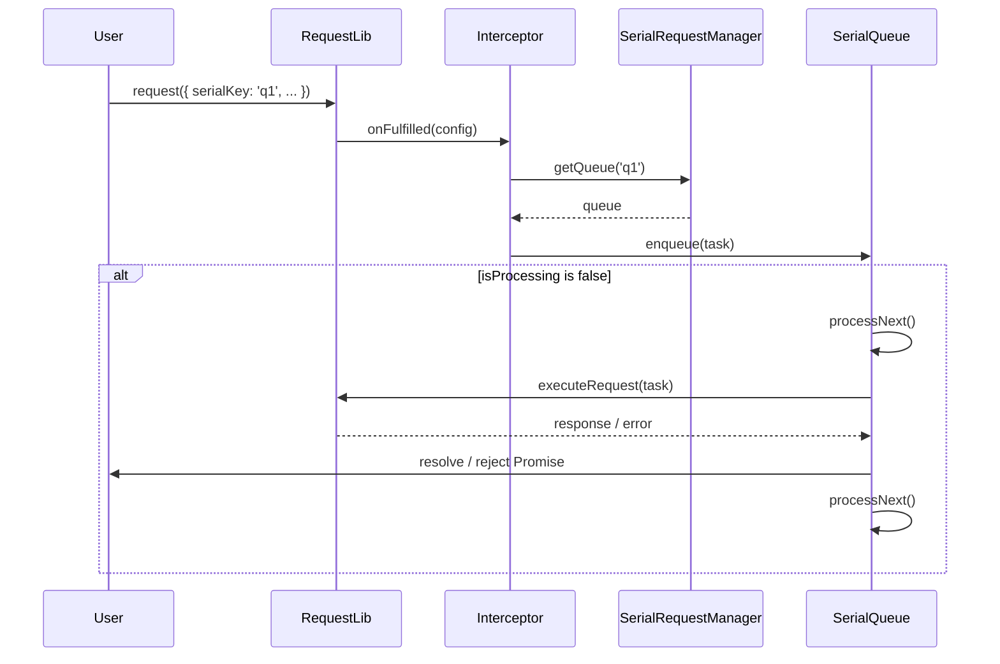

# 串行请求技术方案

## 1. 引言

在复杂的Web应用中，有时需要确保某些请求按照特定的顺序依次执行。例如，一个请求的结果可能是下一个请求的输入，或者为了避免对服务器造成过大压力，需要将一组请求串行化。本方案旨在为 `request-core` 库设计并实现一个健壮、易用的串行请求功能。

## 2. 设计目标

- **易用性**: 用户应能通过简单的配置开启和管理串行请求。
- **灵活性**: 支持多个独立的串行队列，不同队列之间的请求不应相互阻塞。
- **健壮性**: 妥善处理请求成功、失败等情况，并确保队列的正确执行。
- **可扩展性**: 设计应易于未来扩展，例如支持中断队列、动态改变优先级等。

## 3. API 设计

我们建议通过在请求配置中添加一个 `serialKey` 字段来实现。具有相同 `serialKey` 的请求将被放入同一个串行队列中，并按顺序执行。

### 示例

```typescript
import { request } from '@request-core';

// 这两个请求将串行执行，请求B会在请求A完成后才开始
request({
  url: '/api/a',
  method: 'POST',
  data: { step: 1 },
  serialKey: 'user-onboarding'
}).then(responseA => {
  console.log('Request A successful', responseA);
});

request({
  url: '/api/b',
  method: 'POST',
  data: { step: 2 },
  serialKey: 'user-onboarding'
}).then(responseB => {
  console.log('Request B successful', responseB);
});

// 这个请求有不同的 serialKey，它会和上面的队列并行执行
request({
  url: '/api/other',
  serialKey: 'background-tasks'
});

// 这个请求没有 serialKey，它会立即执行，不受任何队列影响
request({
  url: '/api/unrelated'
});
```

## 4. 实现思路

### 4.1.核心组件

1.  **`SerialRequestManager` (串行请求管理器)**:
    -   一个单例或在 `request-core` 实例中唯一的管理器。
    -   内部维护一个 `Map<string, SerialQueue>`，其中 `key` 是 `serialKey`，`value` 是对应的请求队列。

2.  **`SerialQueue` (串行队列)**:
    -   每个队列内部维护一个请求任务数组 `tasks: Task[]`。
    -   一个状态标记 `isProcessing`，用于表示当前是否有请求正在执行。

3.  **`Task` (任务)**:
    -   封装了原始的请求配置和用于解决/拒绝 `Promise` 的 `resolve` 和 `reject` 函数。
    -   `{ config: RequestConfig, resolve: Function, reject: Function }`

### 4.2. 工作流程

1.  **请求拦截**: 使用一个拦截器（Interceptor）来处理串行请求逻辑。这个拦截器将在请求实际发起之前执行。

2.  **请求入队**:
    -   当一个请求进入拦截器时，检查其配置中是否包含 `serialKey`。
    -   如果没有 `serialKey`，请求直接放行。
    -   如果存在 `serialKey`，则：
        -   从 `SerialRequestManager` 中查找对应的 `SerialQueue`。如果不存在，则创建一个新的队列。
        -   将当前请求封装成一个 `Task`，并推入队列的 `tasks` 数组。
        -   返回一个 `new Promise`，并将其 `resolve` 和 `reject` 方法存入 `Task` 中。这个 `Promise` 将在请求实际执行并完成后被解决或拒绝。

3.  **队列处理**:
    -   在将任务推入队列后，调用一个 `processQueue` 方法。
    -   `processQueue` 方法检查队列的 `isProcessing` 状态。如果为 `true`，则直接返回，表示已有请求在处理中。
    -   如果 `isProcessing` 为 `false`，则从 `tasks` 数组中取出一个任务（FIFO）。
    -   如果队列为空，直接返回。
    -   设置 `isProcessing = true`。
    -   实际执行取出的任务中的请求。

4.  **请求完成**:
    -   当请求完成（无论是成功还是失败）时：
        -   使用任务中保存的 `resolve` 或 `reject` 来解决或拒绝之前返回的 `Promise`。
        -   设置 `isProcessing = false`。
        -   再次调用 `processQueue` 方法，以处理队列中的下一个请求。

### 4.3. UML 序列图



## 5. 错误处理

-   如果队列中的一个请求失败，它所对应的 `Promise` 将被 `reject`。
-   该失败不会中断整个队列的执行。请求完成后，`processQueue` 依然会被调用，继续处理下一个请求。
-   用户可以在单个请求的 `.catch()` 中处理特定请求的失败。

## 6. 可扩展性

-   **中断队列**: 未来可以给 `SerialQueue` 添加 `clear()` 或 `cancel()` 方法，以支持中断和清空等待中的请求。
-   **请求优先级**: `Task` 对象可以增加一个 `priority` 字段，`SerialQueue` 可以从数组队列改为优先队列，以支持高优先级请求插队。
-   **动态 `serialKey`**: 可以在请求的生命周期中（例如，在另一个拦截器中）动态添加或修改 `serialKey`。

## 7. 总结

通过引入 `serialKey` 配置和相应的管理器、队列机制，我们可以以一种非侵入性且易于使用的方式为 `request-core` 添加串行请求功能。该设计具有良好的封装性和可扩展性，能够满足大部分应用场景的需求。
