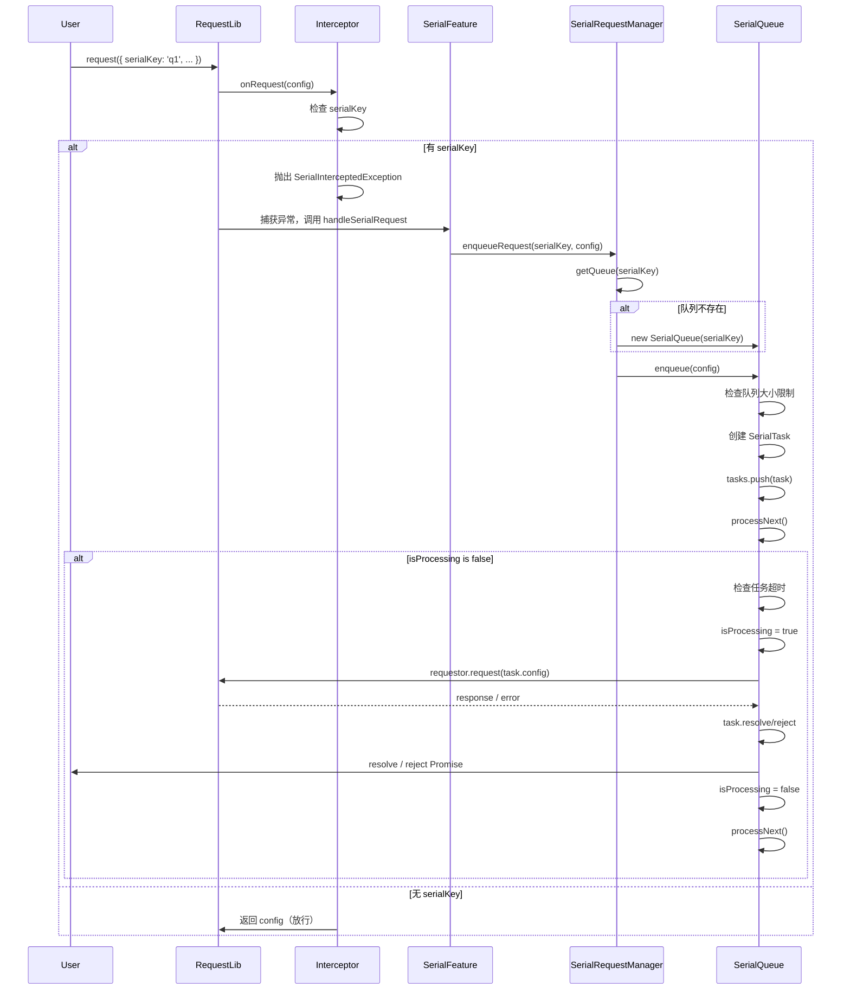

# 串行请求技术方案

## 1. 引言

在复杂的Web应用中，有时需要确保某些请求按照特定的顺序依次执行。例如，一个请求的结果可能是下一个请求的输入，或者为了避免对服务器造成过大压力，需要将一组请求串行化。本方案旨在为 `request-core` 库设计并实现一个健壮、易用的串行请求功能。

## 2. 设计目标

- **易用性**: 用户应能通过简单的配置开启和管理串行请求。
- **灵活性**: 支持多个独立的串行队列，不同队列之间的请求不应相互阻塞。
- **健壮性**: 妥善处理请求成功、失败等情况，并确保队列的正确执行。
- **可扩展性**: 设计应易于未来扩展，例如支持中断队列、动态改变优先级等。
- **资源管理**: 自动清理空队列，避免内存泄漏。
- **可观测性**: 提供详细的日志输出，便于调试和监控。

## 3. API 设计

通过 `SerialFeature` 类提供串行请求功能，用户可以通过配置 `SerialConfig` 和 `SerialManagerConfig` 来自定义串行行为。

### 3.1. 类型定义

```typescript
/**
 * @description 串行请求任务
 */
interface SerialTask {
  id: string                    // 任务唯一标识
  config: RequestConfig         // 请求配置
  resolve: (value: any) => void // Promise resolve 函数
  reject: (reason?: any) => void // Promise reject 函数
  createdAt: number             // 创建时间戳
}

/**
 * @description 串行请求配置
 */
interface SerialConfig {
  maxQueueSize?: number                              // 最大队列大小，默认无限制
  timeout?: number                                   // 队列超时时间(毫秒)，默认无超时
  onQueueFull?: (serialKey: string) => void         // 队列满时回调
  onTaskTimeout?: (task: SerialTask) => void        // 任务超时回调
  debug?: boolean                                    // 调试模式
}

/**
 * @description 串行请求管理器配置
 */
interface SerialManagerConfig {
  defaultQueueConfig?: SerialConfig  // 默认队列配置
  maxQueues?: number                 // 最大队列数量，默认无限制
  cleanupInterval?: number           // 清理间隔(毫秒)，默认30秒
  autoCleanup?: boolean              // 是否自动清理空队列，默认true
  debug?: boolean                    // 调试模式
}

/**
 * @description 任务执行结果
 */
interface TaskResult<T = any> {
  success: boolean
  data?: T
  error?: Error
  executionTime: number
  taskId: string
}
```

### 3.2. 构造函数

`SerialFeature` 构造函数接受以下参数：

```typescript
constructor(
  requestor: Requestor,
  managerConfig?: SerialManagerConfig,
  options?: {
    debug?: boolean
  }
)
```

**参数说明**：
- `requestor`: 实现了 `Requestor` 接口的请求器实例，用于执行实际的网络请求
- `managerConfig`: 可选的串行管理器配置
- `options`: 可选的选项对象
  - `debug`: 是否启用调试模式，默认 `false`

**使用示例**：

```typescript
import { SerialFeature } from '@request-core';

// 创建串行功能实例
const serialFeature = new SerialFeature(requestor);

// 带配置的创建
const serialFeature = new SerialFeature(requestor, {
  defaultQueueConfig: {
    maxQueueSize: 10,
    timeout: 30000
  },
  autoCleanup: true,
  cleanupInterval: 30000
}, {
  debug: true
});
```

### 3.3. 核心方法

#### 3.3.1. handleSerialRequest

处理串行请求的主要方法，通常在拦截器链中被调用。

```typescript
async handleSerialRequest<T = any>(config: RequestConfig): Promise<T>
```

**参数说明**：
- `config`: 请求配置，如果包含 `serialKey` 字段，则会被加入对应的串行队列

**返回值**：
- 返回请求结果的 Promise

**使用示例**：

```typescript
// 通过拦截器使用
const interceptor = serialFeature.getInterceptor();
// 将 interceptor 添加到拦截器链中

// 直接调用
const result = await serialFeature.handleSerialRequest({
  url: '/api/data',
  method: 'GET',
  serialKey: 'my-queue'
});
```

#### 3.3.2. requestSerial

直接发起串行请求的便利方法。

```typescript
async requestSerial<T = any>(
  config: RequestConfig,
  queueConfig?: SerialConfig
): Promise<T>
```

**参数说明**：
- `config`: 请求配置，必须包含 `serialKey` 字段
- `queueConfig`: 可选的队列配置，用于覆盖默认配置

**返回值**：
- 返回请求结果的 Promise

**使用示例**：

```typescript
const result = await serialFeature.requestSerial({
  url: '/api/data',
  method: 'GET',
  serialKey: 'my-queue'
}, {
  maxQueueSize: 5,
  timeout: 10000
});
```

#### 3.3.3. HTTP 方法便利函数

提供了一系列便利方法用于发起不同类型的串行请求：

```typescript
// GET 请求
async getSerial<T = any>(
  url: string,
  serialKey: string,
  config?: Partial<RequestConfig>,
  queueConfig?: SerialConfig
): Promise<T>

// POST 请求
async postSerial<T = any>(
  url: string,
  serialKey: string,
  data?: any,
  config?: Partial<RequestConfig>,
  queueConfig?: SerialConfig
): Promise<T>

// PUT 请求
async putSerial<T = any>(
  url: string,
  serialKey: string,
  data?: any,
  config?: Partial<RequestConfig>,
  queueConfig?: SerialConfig
): Promise<T>

// DELETE 请求
async deleteSerial<T = any>(
  url: string,
  serialKey: string,
  config?: Partial<RequestConfig>,
  queueConfig?: SerialConfig
): Promise<T>

// PATCH 请求
async patchSerial<T = any>(
  url: string,
  serialKey: string,
  data?: any,
  config?: Partial<RequestConfig>,
  queueConfig?: SerialConfig
): Promise<T>
```

**使用示例**：

```typescript
// GET 请求
const users = await serialFeature.getSerial('/api/users', 'user-queue');

// POST 请求
const newUser = await serialFeature.postSerial(
  '/api/users',
  'user-queue',
  { name: 'John', email: 'john@example.com' }
);

// PUT 请求
const updatedUser = await serialFeature.putSerial(
  '/api/users/1',
  'user-queue',
  { name: 'Jane' }
);

// DELETE 请求
await serialFeature.deleteSerial('/api/users/1', 'user-queue');
```

### 3.4. 队列管理方法

#### 3.4.1. getQueueKeys

获取所有队列的标识。

```typescript
getQueueKeys(): string[]
```

**返回值**：
- 返回所有队列标识的数组

**使用示例**：

```typescript
const queueKeys = serialFeature.getQueueKeys();
console.log('Active queues:', queueKeys);
```

#### 3.4.2. clearQueue

清空指定队列，取消所有等待中的任务。

```typescript
clearQueue(serialKey: string): boolean
```

**参数说明**：
- `serialKey`: 队列标识

**返回值**：
- 如果队列存在并成功清空返回 `true`，否则返回 `false`

**使用示例**：

```typescript
const cleared = serialFeature.clearQueue('my-queue');
if (cleared) {
  console.log('Queue cleared successfully');
}
```

#### 3.4.3. clearAllQueues

清空所有队列。

```typescript
clearAllQueues(): void
```

**使用示例**：

```typescript
serialFeature.clearAllQueues();
console.log('All queues cleared');
```

#### 3.4.4. removeQueue

移除指定队列，会先清空队列再移除。

```typescript
removeQueue(serialKey: string): boolean
```

**参数说明**：
- `serialKey`: 队列标识

**返回值**：
- 如果队列存在并成功移除返回 `true`，否则返回 `false`

**使用示例**：

```typescript
const removed = serialFeature.removeQueue('my-queue');
if (removed) {
  console.log('Queue removed successfully');
}
```

#### 3.4.5. removeAllQueues

移除所有队列。

```typescript
removeAllQueues(): void
```

**使用示例**：

```typescript
serialFeature.removeAllQueues();
console.log('All queues removed');
```

#### 3.4.6. hasQueue

检查队列是否存在。

```typescript
hasQueue(serialKey: string): boolean
```

**参数说明**：
- `serialKey`: 队列标识

**返回值**：
- 如果队列存在返回 `true`，否则返回 `false`

**使用示例**：

```typescript
if (serialFeature.hasQueue('my-queue')) {
  console.log('Queue exists');
}
```

#### 3.4.7. cleanup

手动触发清理空队列。

```typescript
cleanup(): void
```

**使用示例**：

```typescript
serialFeature.cleanup();
console.log('Empty queues cleaned up');
```

### 3.5. 功能控制方法

#### 3.5.1. enable

启用串行功能。

```typescript
enable(): void
```

**使用示例**：

```typescript
serialFeature.enable();
```

#### 3.5.2. disable

禁用串行功能。

```typescript
disable(): void
```

**使用示例**：

```typescript
serialFeature.disable();
```

#### 3.5.3. isEnabled

检查功能是否启用。

```typescript
isEnabled(): boolean
```

**返回值**：
- 如果功能启用返回 `true`，否则返回 `false`

**使用示例**：

```typescript
if (serialFeature.isEnabled()) {
  console.log('Serial feature is enabled');
}
```

### 3.6. 其他方法

#### 3.6.1. getInterceptor

获取拦截器实例，用于集成到拦截器链。

```typescript
getInterceptor(): SerialRequestInterceptor
```

**使用示例**：

```typescript
const interceptor = serialFeature.getInterceptor();
// 将 interceptor 添加到拦截器链中
```

#### 3.6.2. getManager

获取管理器实例。

```typescript
getManager(): SerialRequestManager
```

**使用示例**：

```typescript
const manager = serialFeature.getManager();
// 直接操作管理器（高级用法）
```

#### 3.6.3. destroy

销毁功能实例，清理所有资源。

```typescript
destroy(): void
```

**使用示例**：

```typescript
serialFeature.destroy();
```

## 4. 使用示例

### 4.1. 基本串行请求

```typescript
import { SerialFeature } from '@request-core';

const serialFeature = new SerialFeature(requestor);

// 这两个请求将串行执行，请求B会在请求A完成后才开始
const responseA = await serialFeature.requestSerial({
  url: '/api/a',
  method: 'POST',
  data: { step: 1 },
  serialKey: 'user-onboarding'
});

const responseB = await serialFeature.requestSerial({
  url: '/api/b',
  method: 'POST',
  data: { step: 2 },
  serialKey: 'user-onboarding'
});

// 这个请求有不同的 serialKey，它会和上面的队列并行执行
const responseC = await serialFeature.requestSerial({
  url: '/api/other',
  serialKey: 'background-tasks'
});
```

### 4.2. 通过拦截器使用

```typescript
import { SerialFeature } from '@request-core';

const serialFeature = new SerialFeature(requestor);
const interceptor = serialFeature.getInterceptor();

// 将拦截器添加到请求库的拦截器链中
// 之后所有带有 serialKey 的请求都会自动串行化

// 请求会自动被拦截并加入队列
const result1 = await requestor.request({
  url: '/api/data1',
  serialKey: 'my-queue'
});

const result2 = await requestor.request({
  url: '/api/data2',
  serialKey: 'my-queue'
});

// result2 会在 result1 完成后才开始执行
```

### 4.3. 使用便利方法

```typescript
import { SerialFeature } from '@request-core';

const serialFeature = new SerialFeature(requestor);

// 使用便利方法发起串行请求
const users = await serialFeature.getSerial('/api/users', 'user-queue');
const newUser = await serialFeature.postSerial(
  '/api/users',
  'user-queue',
  { name: 'John' }
);
const updatedUser = await serialFeature.putSerial(
  '/api/users/1',
  'user-queue',
  { name: 'Jane' }
);
```

### 4.4. 配置队列大小限制

```typescript
import { SerialFeature } from '@request-core';

const serialFeature = new SerialFeature(requestor, {
  defaultQueueConfig: {
    maxQueueSize: 5,  // 最多允许5个任务在队列中等待
    onQueueFull: (serialKey) => {
      console.warn(`Queue ${serialKey} is full`);
    }
  }
});

// 当队列满时，新的请求会被拒绝
try {
  await serialFeature.requestSerial({
    url: '/api/data',
    serialKey: 'limited-queue'
  });
} catch (error) {
  if (error.code === 'SERIAL_QUEUE_FULL') {
    console.error('Queue is full, request rejected');
  }
}
```

### 4.5. 配置任务超时

```typescript
import { SerialFeature } from '@request-core';

const serialFeature = new SerialFeature(requestor, {
  defaultQueueConfig: {
    timeout: 30000,  // 30秒超时
    onTaskTimeout: (task) => {
      console.warn(`Task ${task.id} timed out after waiting ${Date.now() - task.createdAt}ms`);
    }
  }
});

// 如果任务在队列中等待超过30秒，会被自动取消
try {
  await serialFeature.requestSerial({
    url: '/api/slow',
    serialKey: 'timeout-queue'
  });
} catch (error) {
  if (error.code === 'SERIAL_TASK_TIMEOUT') {
    console.error('Task timed out in queue');
  }
}
```

### 4.6. 队列管理

```typescript
import { SerialFeature } from '@request-core';

const serialFeature = new SerialFeature(requestor);

// 获取所有队列
const queueKeys = serialFeature.getQueueKeys();
console.log('Active queues:', queueKeys);

// 检查队列是否存在
if (serialFeature.hasQueue('my-queue')) {
  console.log('Queue exists');
}

// 清空指定队列（取消所有等待中的任务）
serialFeature.clearQueue('my-queue');

// 移除指定队列
serialFeature.removeQueue('my-queue');

// 清空所有队列
serialFeature.clearAllQueues();

// 移除所有队列
serialFeature.removeAllQueues();

// 手动清理空队列
serialFeature.cleanup();
```

### 4.7. 启用/禁用功能

```typescript
import { SerialFeature } from '@request-core';

const serialFeature = new SerialFeature(requestor);

// 禁用串行功能
serialFeature.disable();

// 此时所有请求都会直接执行，不会被串行化
await serialFeature.requestSerial({
  url: '/api/data',
  serialKey: 'my-queue'  // serialKey 会被忽略
});

// 重新启用
serialFeature.enable();

// 检查功能状态
if (serialFeature.isEnabled()) {
  console.log('Serial feature is enabled');
}
```

### 4.8. 调试模式

```typescript
import { SerialFeature } from '@request-core';

const serialFeature = new SerialFeature(requestor, {
  debug: true
}, {
  debug: true
});

// 启用调试模式后，会在控制台输出详细的日志
// [SerialFeature] Serial feature initialized
// [SerialRequestManager] Manager initialized
// [SerialQueue] Created queue: my-queue
// [SerialQueue] Task enqueued: my-queue-1234567890-abc123 in queue: my-queue
// [SerialQueue] Processing task: my-queue-1234567890-abc123
// [SerialQueue] Task completed: my-queue-1234567890-abc123 in 150ms
```

## 5. 实现思路

### 5.1. 核心组件

1. **`SerialFeature` (串行功能类)**:
   - 封装串行请求逻辑的核心类，对外提供完整的 API。
   - 内部包含 `SerialRequestManager` 和 `SerialRequestInterceptor` 实例。
   - 提供便利方法和队列管理功能。

2. **`SerialRequestManager` (串行请求管理器)**:
   - 管理多个独立的串行队列。
   - 内部维护一个 `Map<string, SerialQueue>`，其中 `key` 是 `serialKey`，`value` 是对应的请求队列。
   - 支持自动清理空队列，避免内存泄漏。
   - 支持限制最大队列数量。

3. **`SerialQueue` (串行队列)**:
   - 管理单个串行队列的任务执行。
   - 内部维护一个任务数组 `tasks: SerialTask[]`，按 FIFO 顺序执行。
   - 使用 `isProcessing` 标记当前是否有请求正在执行。
   - 支持队列大小限制和任务超时。

4. **`SerialRequestInterceptor` (串行请求拦截器)**:
   - 拦截带有 `serialKey` 的请求。
   - 通过抛出 `SerialInterceptedException` 来"劫持"请求执行流程。
   - 将请求加入对应的串行队列。

5. **`SerialTask` (串行任务)**:
   - 封装了原始的请求配置和用于解决/拒绝 `Promise` 的 `resolve` 和 `reject` 函数。
   - 包含任务唯一标识 `id` 和创建时间戳 `createdAt`。

### 5.2. 工作流程

1. **请求拦截**:
   - 当请求进入 `SerialRequestInterceptor` 时，检查其配置中是否包含 `serialKey`。
   - 如果没有 `serialKey` 或功能未启用，请求直接放行。
   - 如果存在 `serialKey`，则抛出 `SerialInterceptedException` 异常。

2. **异常处理**:
   - 拦截器链需要捕获 `SerialInterceptedException` 异常。
   - 从异常中提取请求配置、队列配置和管理器实例。
   - 调用管理器的 `enqueueRequest` 方法将请求加入队列。

3. **请求入队**:
   - 从 `SerialRequestManager` 中查找对应的 `SerialQueue`。如果不存在，则创建一个新的队列。
   - 检查队列大小限制（包括等待中的任务和正在处理的任务）。
   - 如果队列已满，拒绝请求并触发 `onQueueFull` 回调。
   - 将当前请求封装成一个 `SerialTask`，并推入队列的 `tasks` 数组。
   - 返回一个 `Promise`，其 `resolve` 和 `reject` 方法存入 `Task` 中。

4. **队列处理**:
   - 在将任务推入队列后，调用 `processNext` 方法。
   - `processNext` 方法检查队列的 `isProcessing` 状态。如果为 `true`，则直接返回。
   - 如果 `isProcessing` 为 `false` 且队列不为空，则：
     - 从 `tasks` 数组中取出一个任务（FIFO）。
     - 检查任务是否超时（基于创建时间和当前时间）。
     - 设置 `isProcessing = true`。
     - 执行请求。

5. **请求完成**:
   - 当请求完成（无论是成功还是失败）时：
     - 使用任务中保存的 `resolve` 或 `reject` 来解决或拒绝之前返回的 `Promise`。
     - 设置 `isProcessing = false`。
     - 再次调用 `processNext` 方法，以处理队列中的下一个请求。

6. **自动清理**:
   - `SerialRequestManager` 会定期检查所有队列。
   - 如果队列为空且没有正在处理的任务，则自动移除该队列。
   - 清理间隔默认为 30 秒，可通过 `cleanupInterval` 配置。

### 5.3. 任务 ID 生成机制

任务 ID 的格式为：`{serialKey}-{timestamp}-{randomString}`

- `serialKey`: 队列标识
- `timestamp`: 创建时间戳
- `randomString`: 9 位随机字符串（使用 `Math.random().toString(36).substring(2, 11)` 生成）

这确保了每个任务都有唯一的标识符，便于调试和追踪。

### 5.4. UML 序列图



## 6. 错误处理

### 6.1. 队列满错误

当队列中的任务数（包括等待中的任务和正在处理的任务）达到 `maxQueueSize` 限制时，新的请求会被拒绝。

**错误信息**：
- 错误类型：`RequestErrorType.VALIDATION_ERROR`
- 错误码：`SERIAL_QUEUE_FULL`
- 错误消息：`Serial queue is full`

**处理示例**：

```typescript
try {
  await serialFeature.requestSerial({
    url: '/api/data',
    serialKey: 'limited-queue'
  });
} catch (error) {
  if (error.code === 'SERIAL_QUEUE_FULL') {
    console.error('Queue is full, request rejected');
    // 可以触发 onQueueFull 回调
  }
}
```

### 6.2. 任务超时错误

当任务在队列中等待的时间超过 `timeout` 配置时，任务会被自动取消。

**错误信息**：
- 错误类型：`RequestErrorType.TIMEOUT_ERROR`
- 错误码：`SERIAL_TASK_TIMEOUT`
- 错误消息：`Task timeout in serial queue`

**处理示例**：

```typescript
try {
  await serialFeature.requestSerial({
    url: '/api/slow',
    serialKey: 'timeout-queue'
  });
} catch (error) {
  if (error.code === 'SERIAL_TASK_TIMEOUT') {
    console.error('Task timed out in queue');
    // 可以触发 onTaskTimeout 回调
  }
}
```

### 6.3. 队列清空错误

当队列被清空时，所有等待中的任务会被取消。

**错误信息**：
- 错误类型：`RequestErrorType.VALIDATION_ERROR`
- 错误码：`SERIAL_QUEUE_CLEARED`
- 错误消息：`Serial queue cleared`

**处理示例**：

```typescript
const promise = serialFeature.requestSerial({
  url: '/api/data',
  serialKey: 'my-queue'
});

// 在另一个地方清空队列
serialFeature.clearQueue('my-queue');

try {
  await promise;
} catch (error) {
  if (error.code === 'SERIAL_QUEUE_CLEARED') {
    console.error('Queue was cleared, task cancelled');
  }
}
```

### 6.4. 请求失败处理

如果队列中的一个请求失败，它所对应的 `Promise` 将被 `reject`。该失败**不会中断**整个队列的执行。请求完成后，`processNext` 依然会被调用，继续处理下一个请求。

**处理示例**：

```typescript
// 请求A失败，但不会影响请求B的执行
const promiseA = serialFeature.requestSerial({
  url: '/api/a',
  serialKey: 'my-queue'
}).catch(error => {
  console.error('Request A failed:', error);
  // 处理请求A的失败
});

const promiseB = serialFeature.requestSerial({
  url: '/api/b',
  serialKey: 'my-queue'
}).then(result => {
  console.log('Request B succeeded:', result);
  // 请求B会在请求A完成后执行，即使请求A失败
});
```

## 7. 配置说明

### 7.1. SerialConfig（队列配置）

| 配置项 | 类型 | 默认值 | 说明 |
|--------|------|--------|------|
| `maxQueueSize` | `number \| undefined` | `undefined` | 最大队列大小，包括等待中的任务和正在处理的任务。如果未设置，则无限制 |
| `timeout` | `number \| undefined` | `undefined` | 任务在队列中的最大等待时间（毫秒）。如果任务等待时间超过此值，会被自动取消。如果未设置，则无超时 |
| `onQueueFull` | `((serialKey: string) => void) \| undefined` | `undefined` | 队列满时的回调函数 |
| `onTaskTimeout` | `((task: SerialTask) => void) \| undefined` | `undefined` | 任务超时时的回调函数 |
| `debug` | `boolean` | `false` | 是否启用调试模式，启用后会输出详细的日志 |

### 7.2. SerialManagerConfig（管理器配置）

| 配置项 | 类型 | 默认值 | 说明 |
|--------|------|--------|------|
| `defaultQueueConfig` | `SerialConfig \| undefined` | `undefined` | 默认队列配置，新建队列时会使用此配置 |
| `maxQueues` | `number \| undefined` | `undefined` | 最大队列数量。如果未设置，则无限制 |
| `cleanupInterval` | `number` | `30000` | 自动清理空队列的间隔（毫秒），默认30秒 |
| `autoCleanup` | `boolean` | `true` | 是否自动清理空队列，默认启用 |
| `debug` | `boolean` | `false` | 是否启用调试模式，启用后会输出详细的日志 |

### 7.3. 配置示例

```typescript
import { SerialFeature } from '@request-core';

// 完整配置示例
const serialFeature = new SerialFeature(requestor, {
  // 默认队列配置
  defaultQueueConfig: {
    maxQueueSize: 10,           // 每个队列最多10个任务
    timeout: 30000,             // 任务最多等待30秒
    onQueueFull: (serialKey) => {
      console.warn(`Queue ${serialKey} is full`);
    },
    onTaskTimeout: (task) => {
      console.warn(`Task ${task.id} timed out`);
    },
    debug: false
  },
  // 管理器配置
  maxQueues: 100,               // 最多100个队列
  cleanupInterval: 30000,        // 每30秒清理一次空队列
  autoCleanup: true,            // 启用自动清理
  debug: true                   // 启用调试模式
}, {
  debug: true                   // 功能级别的调试模式
});
```

## 8. 最佳实践

### 8.1. 选择合适的 serialKey

- 使用有意义的标识符，便于调试和管理。
- 不同业务场景使用不同的 `serialKey`，避免不必要的阻塞。
- 例如：`user-{userId}`、`order-{orderId}`、`upload-{fileId}` 等。

### 8.2. 合理设置队列大小限制

- 根据业务需求设置 `maxQueueSize`，避免队列无限增长。
- 对于高并发场景，建议设置合理的限制值。

### 8.3. 设置任务超时

- 对于可能长时间等待的场景，建议设置 `timeout`。
- 超时时间应该大于单个请求的平均执行时间。

### 8.4. 错误处理

- 始终使用 `try-catch` 处理串行请求的错误。
- 根据错误码进行不同的处理逻辑。
- 在 `onQueueFull` 和 `onTaskTimeout` 回调中记录日志或发送监控。

### 8.5. 资源清理

- 在应用关闭时调用 `destroy()` 方法清理资源。
- 对于不再使用的队列，及时调用 `removeQueue()` 移除。

### 8.6. 调试模式

- 在开发环境中启用 `debug` 模式，便于排查问题。
- 在生产环境中关闭 `debug` 模式，避免日志过多。

## 9. 可扩展性

### 9.1. 已实现的功能

- ✅ **中断队列**: 通过 `clearQueue()` 和 `clearAllQueues()` 方法支持中断和清空等待中的请求。
- ✅ **自动清理**: 支持自动清理空队列，避免内存泄漏。
- ✅ **队列管理**: 提供完整的队列管理 API，包括查询、清空、移除等操作。

### 9.2. 未来可能的扩展

- **请求优先级**: `Task` 对象可以增加一个 `priority` 字段，`SerialQueue` 可以从数组队列改为优先队列，以支持高优先级请求插队。
- **动态 `serialKey`**: 可以在请求的生命周期中（例如，在另一个拦截器中）动态添加或修改 `serialKey`。
- **队列统计**: 提供队列统计信息，如平均等待时间、任务执行时间等。
- **队列持久化**: 支持将队列状态持久化，以便在应用重启后恢复。

## 10. 总结

通过引入 `serialKey` 配置和相应的管理器、队列机制，我们可以以一种非侵入性且易于使用的方式为 `request-core` 添加串行请求功能。该设计具有良好的封装性和可扩展性，能够满足大部分应用场景的需求。

主要特性：
- ✅ 支持多个独立的串行队列
- ✅ 支持队列大小限制和任务超时
- ✅ 自动清理空队列，避免内存泄漏
- ✅ 提供完整的队列管理 API
- ✅ 支持启用/禁用功能
- ✅ 提供详细的调试日志
- ✅ 完善的错误处理机制
